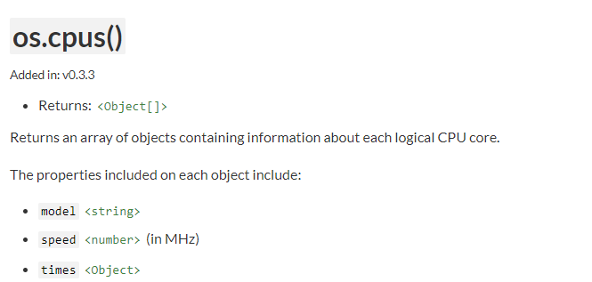

# Ejemplo 2

## Objetivo

Conocer y trabajar con módulos del core y módulos de terceros.

## Requerimientos

Tener instalado Nodejs

## Desarrollo

### Módulos del core

Node.js tiene módulos que ofrece de manera nativa, es decir, no requiere instalación de nada mas para ser utilizados (los módulos compilados se encuentran en la instalación de Nodejs en la carpeta **lib/**), a estos se les conoce como modulos del core.

Node ofrece una gran cantidad de modulos, podemos encontrarlos en su documentación: 

[Node.js v14.5.0 Documentation](https://nodejs.org/dist/latest-v12.x/docs/api/modules.html#modules_core_modules)


#  ENTENDAMOS LOS MODULOS  👊

### ¿QUE SON LOS MODULOS?

Son herramientas o grupo de funciones prefabricadas que nos facilitan la construcción de nuestro código.

### ¿COMO SE USAN?

Imagenemos que tenemos que ir a la escuela, y nuestra mochila es nuestro documento de javascript "mochila.js", ahora imaginemos que cada materia es un modulo, y ese dia tendremos que ver 3 materias, matematicas, fisica y quimica. Entonces... yo necesito meter cada libro en la mochila para poder llevar esas materias. 

Ahora pensemos que la manera de realizar la acción de meter los libros a la mochila requiere un comado, y ese comando es el siguiente : 

```jsx
var MATEMATICAS = require('LIBRO_DE_MATEMATICAS');
var FISICA      = require('LIBRO_DE_FISICA');
var QUIMICA     = require('LIBRO_DE_QUIMICA'); 
```
Entonces en mi archivo mochila.js ya tengo 3 variables que cada una esta cargando una materia.

Ahora si una materia es igual a un modulo, esto quiere decir que tengo 3 modulos cargados en mi archivo, si lo pasamos al mundo de node, eso quiere decir que puedo cargar los modulos mandadolos llamar con esta sintaxis:

```jsx
var VARIABLE_DONDE_SE_GUARDARA = require('NOMBRE_DEL_MODULO');
```

Basicamente la función ``` "require()" ``` es la que se encarga de cargar los modulos en nuestro archivo, a este proceso se le conoce como : INYECCION DE DEPENDENCIAS.

Existen 3 tipos de modulos que podemos utilizar en nuestros proyectos:

- MODULOS INTEGRADOS DE NODE.JS
- MODULOS DE TERCEROS NPM
- MODULOS CREADOS


##  💥 MODULOS INTEGRADOS DE NODE.JS   💥

Estos modulos ya vienen integrados en node.js no requieren ningún tipo de instalación, solo los mandamos llamar directo y podremos hacer uso de ellos. 

Si revisamos la [lista de modulos](https://nodejs.org/dist/latest-v14.x/docs/api/), encontraremos el modulo OS, 
este modulo nos permite revisar los datos del hardware de nuestra computadora, como uso de CPU, memoria, cuantos cores tiene de procesador etc. 

Si yo quiero saber cuantos CPU tiene mi computadora, con el modulo de OS, el primer paso seria cargar el modulo en mi archivo
```jsx
var os = require('os');
```

El siguiente paso seria revisar la documentación para determinar cual función del modulo OS es la que me permite ver los CPUS (Procesadores)



podemos observar que para saber cuantos CPU tengo, se usa la funcion ``` cpus() ``` 

lo siguiente entonces es llamar la funcion cpus() y almacenaremos en una variable que llevara el nombre de "misCpu" tmb imprimire la variable en consola para ver el resultado final:

--- EJEMPLO COMPLETO ---

```jsx
var os = require('os');

var misCpu = os.cpus();

console.log(misCpu);

```


## 🐼 USANDO MODULOS DE TERCEROS CON NPM 🐼

Node.js tiene un numero limitado de modulos que nos ofrece de manera nativa como lo vemos en la documentación, por ello npm viene a solucionarnos la vida, ya que en sus arcas, podemos encontrar millones de modulos para hacer cualquier cosa que querramos, pero a diferencia de los modulos de node.js, los de npm requieren una serie de procesos para incorporarlos a nuestros proyectos.

Sigamos los pasos a continuación para poder lograr esto:

1. Iniciar npm en el proyecto en la carpeta donde tienes o pretendes tener tu proyecto de node.js.

    ❗ LA CARPETA DONDE ALMACENES TU PROYECTO NO SE PUEDE LLAMAR COMO ALGUN MODULO DE NODE.JS NI DE EXTERNOS ❗ 

    ```bash
    npm init -y 
    ```


2. A continuación, se creará un archivo package.json, este archivo representa la configuración del proyecto y de las dependencias(modulos) que se instalaran en el.

    ```bash
    {
      "name": "sesion1", // Nombre del proyecto 
      "version": "1.0.0", // Versión del proyecto
      "description": "", // Breve descripción del proyecto
      "main": "ejemplo.js", // Archivo con el que inicia el proyecto.
      "scripts": { // scripts o funciones personalizadas
        "test": "echo \"Error: no test specified\" && exit 1"
      },
      "author": "", // Creador del proyecto
      "license": "ISC" // Tipo de licencia
    }
    ```
3. Una vez hecho esto, procederemos a bajar el modulo o paquete de la nube de NPM, para esto es necesario tener internet, la manera de hacerlo es utilizando el comando install de npm. Para este ejemplo vamos a utilizar el modulo [moment.js](https://www.npmjs.com/package/moment/) utilizando el comando:   
❗ ES IMPORTANTE QUE ESTEMOS EN LA CARPETA DONDE TENEMOS NUESTRO PACKAGE.JSON, DE OTRO MODO FALLARA LA INSTALACION ❗ 


```bash
npm install moment
```

Revisando el archivo package.json notamos que sea agrega el campo *dependencies* y dentro el módulo instalado, además, se creó el directorio **node_modules/** que será la carpeta dónde estarán todos los archivos de los paquetes instalados:

```json
"dependencies": {
    "moment-timezone": "^0.5.31"
  }
```

De modo que si por alguna razón borramos la carpeta **node_modules/** dejarán de funcionar estos módulos. Si ocurre esto bastará con ejecutar el comando :

```bash
npm install
```

Ya que, nuestros módulos instalados se encuentran especificados en el archivo package.json

4. Para cargar esto módulos ocupamos la misma función **require()**

```jsx
var moment = require('moment');
```

5. Al igual que nuestro ejemplo de modulos del core de node, una ves que lo integramos, ya lo podemos utilizar.

-- EJEMPLO COMPLETO ---

```jsx
var  moment = require("moment");

var  now = moment();

console.log(`Hoy es ${now}`);

```


## 🐌 CREANDO MIS MODULOS Y UTILIZANDOLOS 🐌


Crear un modulo propio es igual que crear un código externo y utilizarlo en nuestro proyecto principal.

Hagamoslo !! 🤘 🔥 🔥

Primero en una carpeta nueva vamos a crear dos archivos:

- principal.js
- modulo.js

El archivo principal.js contendra nuestro proyecto y modulo.js sera nuestro modulo.

nuestro archivo pricipal tendra la llamada una funcion llamada sumar()

principal.js
```jsx
sumar(2,2)
```
y nuestro archivo modulo.js tendra lo siguiente : 

```jsx

function sumar (num1, num2) {
    console.log(num1 + num2)
}

```

Ahora para conectar al archivo princpial.js y al modulo.js necesito 2 cosas:

PASO 1 ⚡: Mandar llamar de mi archivo principal.js el modulo con la funcion require()

principal.js
```jsx
var sumar = require('./modulo')
sumar(2,2)
```
Aqui sucede algo diferente a la importación de modulos de node y de npm... y es que cuando mando llamar un modulo creado por mi, lo hago buscando la ubicación del archivo en mi computadora, por eso le agrego el "./", ese "./" significa que buscara el archivo que quiero importar desde la ubicación donde me encuentro en ese momento, si el archivo modulo.js estuviera dentro de una carpeta entonces lo llamaría asi :

principal.js
```jsx
var sumar = require('./carpeta/modulo')
sumar(2,2)
```

❗ NO SE NECESITA PONER LA EXTENCION DEL ARCHIVO EN LOS REQUIRE CUANDO ES UN ARCHIVO JS ❗


PASO 2 ⚡: Ahora necesito convertir mi archivo modulo.js en un modulo de node.js, por lo que agregare la sentencia siguiente:

modulo.js
```jsx

function sumar (num1, num2) {
    console.log(num1 + num2)
}

module.exports = sumar; // <== le digo que la función sumar es un modulo y que la exportare para que pueda ser utilizada por quien la mande llamar con el require() 
```

ahora si, cuando utilizo la función sumar en mi archivo principal.js utilizara la función del archivo modulo.js


--- EJEMPLO COMPLETO ---


principal.js
```jsx
var sumar = require('./modulo')
sumar(2,2)
```


modulo.js
```jsx

function sumar (num1, num2) {
    console.log(num1 + num2)
}

module.exports = sumar; 
```

