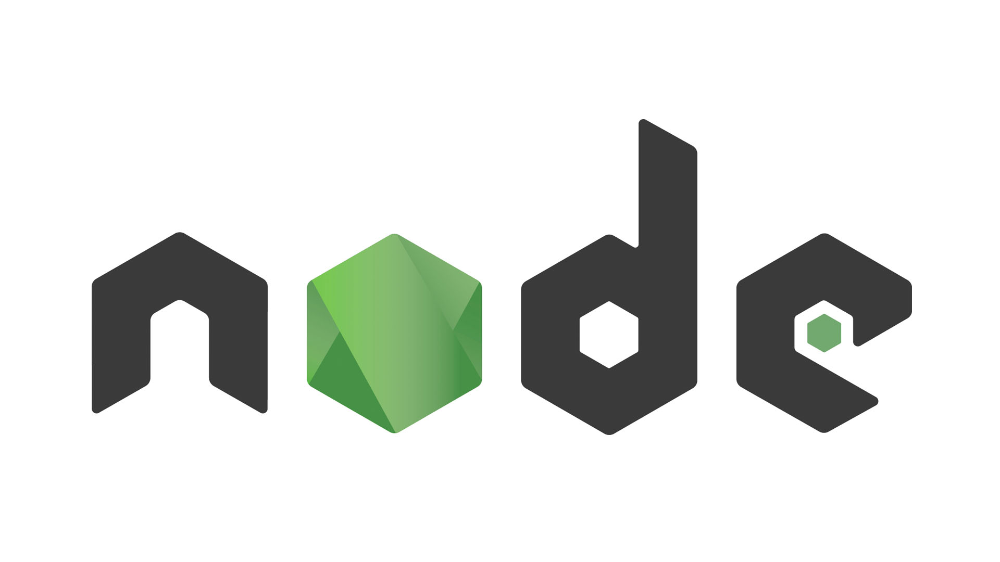
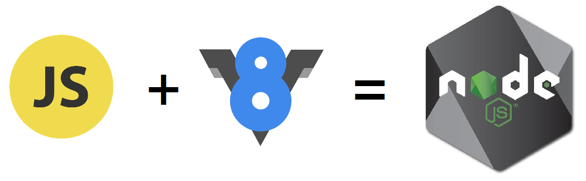
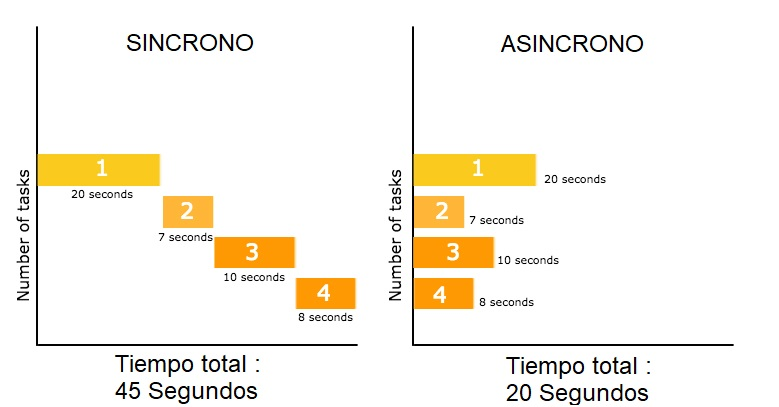
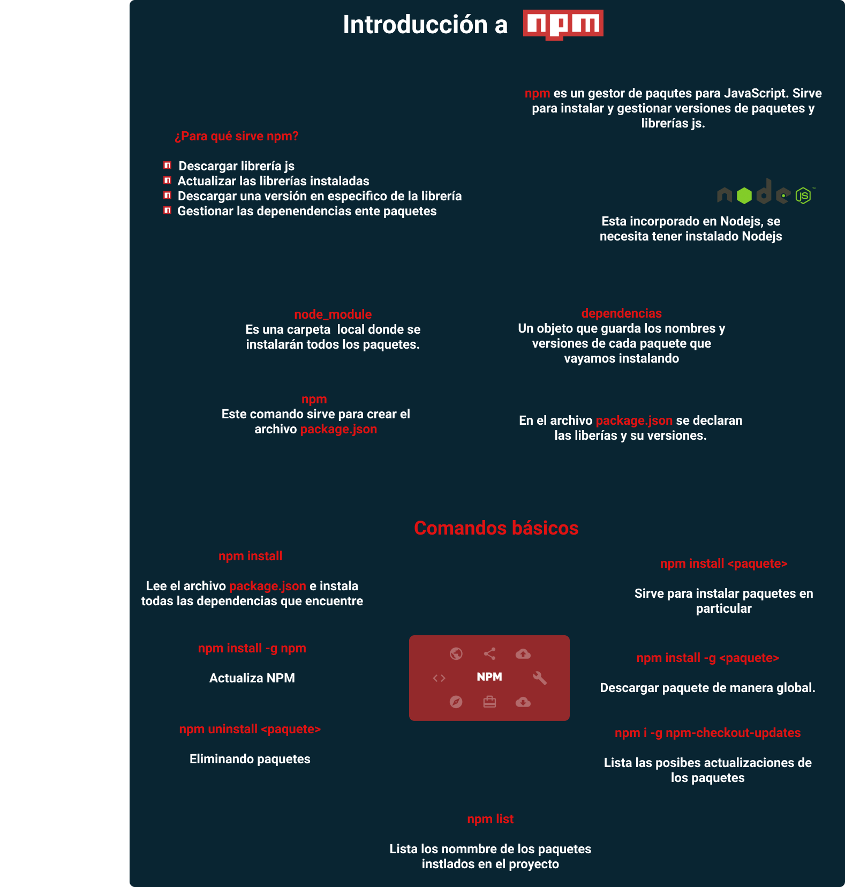

# Prework

**Node.js** es un entorno de ejecución de **JavaScript** que ha aportado mucho a este lenguaje, dándole por primera vez la posibilidad de actuar del lado del servidor. Convirtiendo así a JavaScript en un lenguaje que abarca tanto el **Frontend** como **Backend**, lo que se conoce también como **Full Stack**.

Este es un entorno extremadamente popular hoy en día. Tanto, que compañías tan grandes como **PayPal**, la **NASA** y **Netflix** lo utilizan.

## **¿QUÉ ES NODE.JS?**

**Node.js** es un entorno de ejecución para **JavaScript** construido con el motor de **JavaScript V8** de **Chrome**. Node.js usa un modelo de operaciones **E/S** sin bloqueo y orientado a eventos, que lo hace liviano y eficiente. El ecosistema de paquetes de Node.js, **npm**, es el ecosistema mas grande de librerías de código abierto en el mundo.

[Documentación | Node.js](https://nodejs.org/es/docs/)

## **¿PARA QUÉ SIRVE NODE.JS?**

En el mundo informático, existen diferentes métodos de administración de aplicaciones de alto nivel para el back-end, node.js es un runtime (Entorno de ejecución), que nos permite tener una alternativa de servidor, pero basado en el lenguaje JavaScript.   

Node.js no es un lenguaje de programación, solo ejecuta Javascript sin la necesidad de un navegador, esto permite que podamos utilizar este lenguaje como herramienta de interoperabilidad entre la parte del front end y la del back-end como aplicación isomórfica (Una aplicación isomórfica es aquella que tiene el mismo lenguaje tanto de front end, como de back end), lo cual nos da las bondades del lenguaje, por mencionar algunos:  escalabilidad, ligereza, estabilidad, y de fácil entendimiento.   

Javascript es un lenguaje no tipado, es decir, no usa un modelo rígido de estructura, por tanto, nos otorga la flexibilidad para poder operar de manera diferente a los lenguajes de Programación Orientada a Objetos, esto le da ventajas de estructura y maniobra sobre sus competencias.   

Al ser este un lenguaje tan ligero, la velocidad con la que responde es tan rápida, que se considera perfecto para todo tipo de aplicaciones web y de REAL TIME (tiempo real).   

El poder de sus aplicaciones no tiene límites, puede ser aplicado desde Robótica, Inteligencia Artificial, Seguridad Monetaria, Blockchain hasta aplicativos live Cams, Chats, Foros, E-commerce, Cms, GPS, etc. 💪

## **¿QUÉ ES UN ENTORNO DE EJECUCIÓN?**

Un **entorno de ejecución** (runtime environment en inglés) es un estado de **máquina virtual** que suministra servicios para los procesos de un programa de computadora que se está ejecutando. 

  

Es decir, Node.js requiere ciertas herramientas para ejecutarse, pero muchas de estas pueden no estar en tu sistema operativo, entones node.js en ves de pedirte que instales todo lo que necesita, el virtualiza todo lo que le hace falta y con eso anda sin pedirte nada mas, el trae su balon para jugar.   

### CARACTERÍSTICAS DE NODE.JS

- **Construido con V8:**

    

    **¿Qué es V8?**

    V8 es un motor open-source escrito en C++ para compilar JavaScript y WebAssembly en código máquina. Esto quiere decir que traduce JavasScript a un código puramente digital capaz de ser interpretado por la CPU donde se ejecuta.

    Este motor fue desarrollado por **Google** para **Google Chrome** y su primera versión vio la luz en 2008 junto con la primera versión del navegador.

    [V8](https://v8.dev)

    **V8 y node.js**

    Una característica del motor V8 es que es independiente del navegador en el que está alojado. Esta característica fue clave el rápido auge de Node.js.

    V8 fue elegido para ser el motor que impulsó Node.js en 2009. A medida que la popularidad de Node.js creció, V8 se convirtió en un gran motor para ejecutar JavaScript del lado del servidor.

    - **Modelo asíncrono orientado a eventos**

    La tercera ley de Newton o principio de acción y reacción, en resumen nos dice que cuando dos cuerpos tienen interaccion entre ellos, aparecen fuerzas iguales y de sentidos opuestos en cada uno de ellos, es decir, con cada acción hay una reacción, ahora llevemos esto al mundo informatico, tenemos que node.js orientado a eventos, como dice la ley, el espera a que algo pase para reaccionar.

    Como dos canicas cochando entre ellas, node siempre esta escuchando o esta a la espera de que pase algo para reaccionar y realizar las tareas correspondientes, esto lo logra a traves de su single thread (Hilo Unico), que es un motor que siempre esta prendido a la espera de que pase algo. 

    - **E/S sin bloqueos**

  

    En otros lenguajes de Back-end, usualmente se manera como procesos basados en Hilos, es decir, cada proceso toma una linea de tiempo de ejecucion, si yo tengo 4 procesos cada 1 toma 1 hilo y los ejecuta en secuencia, como fichas de domino, una ves que termina una tarea, continua con la que sigue, a esto se le conoce como codigo bloqueante.

    En Node tenemos el modo Asyncrono, quiere decir, las tareas no requieren un orden de ejecucion, simplemente se disparan todas al mismo tiempo utilizando solo un 1 hilo, sin bloquear las otras tareas, permitiendo atender multiples acciones al mismo tiempo, mejorando notablemente el rendimiento y el tiempo de respuesta. 

    # NPM

    

    **npm** es el gestor de paquetes que viene incluído en la instalación de Node.js, así que para instalarlo simplemente tendrás que instalar NodeJS. 

    Pero… **¿Qué son los paquetes?**   

    Imagina un grupo de personas que por gusto, Hobie, o cualquer razón, crearon un sistema de geolocalización, y simplemente tomaron la desición de no cobrarlo y regarlo al mundo, el medio de distribucion de este sistema sera NPM, y al sistema de geolicalización se le conocera como paquete o modulo.

    Cualquier persona puede crear y subir una funcionalidad o software completo a NPM, por tanto estara disponible para utilizarlo en tus proyectos.
    

    [npm](https://www.npmjs.com)

    ### ¿Entonces ... para qué sirve NPM?

    NPM es un repositiorio que contiene los paquetes, te da las herramientas para que puedas descargar o acualizar cualquier paquete para utilizarlos en tu proyecto, por eso se le conoce como gestor, administrador u orquestador de paquetes.

    ⚠️**ProTip**

    