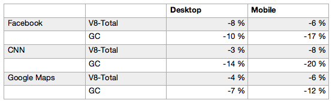

# Prework

**Node.js** es un entorno de ejecución de **JavaScript** creado en el año 2010, dando la posibilidad de ejecutar código fuera del navegador. Su uso principal es para la creación de servidores (lo que conocemos hoy en día como Back-end) pero también puede utilizarse para Aplicaciones Móviles, Aplicaciones de Escritorio, Internet de las Cosas, etc.

**Node.js** es una tecnología extremadamente popular hoy en día, teniendo un aumento en el número de vacantes disponibles en el ámbito laboral. Es ideal para crear funciones a tiempo real como podrían ser un chat o un sistema de notificaciones en vivo.

## **¿QUÉ ES NODE.JS?**

Como ya lo habíamos mencionado anteriormente Node.js es un entorno de ejecución para JavaScript construido con el motor de **JavaScript V8 de Chrome**. Usa un modelo de concurrencia para manejar operaciones de **Entrada y Salida (E/S)** sin bloqueo y orientado a eventos, que lo hace liviano y eficiente. El ecosistema de paquetes de Node.js, **npm**, es el ecosistema más grande de librerías de código abierto en el mundo.

**Importante:**

En windows los comandos **tienen diversas variaciones**. Si tienes problemas basta con googlear para buscar su equivalente.

## **¿PARA QUÉ SIRVE NODE.JS?**

  * **CHATS**

  Debido a la naturaleza asíncrona y orientada a eventos de node.js, este es ideal para desarrollar **chats**. Si lo piensas estas son las características que necesita un chat para ser funcional.
  Tanto el servidor como el cliente estarán siempre comunicados y en cuanto uno de los usuarios escriba un mensaje, Node.js **reaccionaría al evento** y de manera rápida comunicaría el mensaje al otro usuario.

  * **REDES SOCIALES**
  Vivimos en un mundo dominado por las Redes Sociales, cada día hay más y más y son millones las personas las que las utilizan a diario. Nunca sabes si puedes crear la próxima Red Social exitosa, ya sea mundialmente o en su nicho y por supuesto es una muy buena idea crearla con Node.js.

  Una red social debe funcionar a tiempo real y en ese aspecto Node.js es el rey.

  * **CUALQUIER COSA QUE TE PUEDAS IMAGINAR**

  Si bien hemos mencionado la importancia de Node.js en implementaciones que conllevan tiempo real, eso no limita a que puedas implementar desde una página web hasta una tienda en línea.

## CARACTERÍSTICAS DE NODE.JS

  **¿Qué es V8?**

  V8 es un motor open-source escrito en C++ para compilar JavaScript y WebAssembly en código máquina. Esto quiere decir que traduce JavasScript a un código puramente digital capaz de ser interpretado por la CPU donde se ejecuta.

  Este motor fue desarrollado por **Google** para **Google Chrome** y su primera versión vio la luz en 2008 junto con la primera versión del navegador.

  Además de Chrome, el resto de navegadores basados en **Chromium** también usan este motor como, por ejemplo, en el nuevo **Microsoft Edge**. El motivo por el que este motor es tan eficiente y rápido es precisamente porque compila el código JavaScript en lugar de interpretarlo, lo cual baja drásticamente su tiempo de ejecución.

  Además de esto, V8 se encarga de gestionar el **call stack**, que es la pila de ejecución; el **memory heap**, que es la zona de almacenamiento dinámica donde se almacenan las **variables declaradas** en los **bloques** y el **garbage collector** para **limpiar** y **liberar espacio**. Por último, proporciona todos los tipos de **datos**, **operadores**, **objetos** y **funciones**.

  **V8 y node.js**

  Una característica del motor V8 es que es independiente del navegador en el que está alojado. Esta característica fue clave el rápido auge de Node.js.

  V8 fue elegido para ser el motor que impulsó Node.js en 2009. A medida que la popularidad de Node.js creció, V8 se convirtió en un gran motor para ejecutar JavaScript del lado del servidor.

  **Tamaño y velocidad**

  Gracias a la compresión de punteros es capaz de reducir en un 40% el uso de memoria. En la práctica, esto se traduce en una carga más rápida de las webs. Estos son los números de las pruebas que ha hecho el equipo de V8 sobre webs reales:

  

  **JavaScript en servidor/backend**

  JavaScript siempre ha sido conocido por ser el lenguaje de programación web que actúa en el lado del **cliente** (Frontend), pero en pocas ocasiones ha podido interactuar por el lado del **servidor** (Backend) y no de manera nativa. Para esta labor siempre se han encargado otros lenguajes como por ejemplo **PHP**, **Python** o **Ruby**.

  Pero todo esto ha cambiado con Node.js. Ahora JavaScript puede actuar por los dos lados, tanto para el lado del cliente como para el del servidor, pudiendo así encargarse de todo por sí mismo.

  **Modelo asíncrono orientado a eventos**

  Estamos muy acostumbrados a que cuando se realiza algún cambio en la página para visualizarlo tenemos que volver a recargar dicha página.

  Por ejemplo; si se cambia el texto de este post mientras tu estás leyendo, hasta que tú no recargues la página no serías capaz de ver los cambios, y por supuesto, nadie te avisará de ello.

  Node.js funciona en tiempo real y por ello, cada vez que ocurra algún evento este será modificado inmediatamente de forma que el cliente aun estando dentro de la página vea el cambio.

  Esta es de hecho una de las características principales y uno de los motivos por los cuales Node.js se utiliza tanto hoy en día. Se podría considerar como la programación del futuro, una programación más eficiente, sólida e interactiva.

  **E/S sin bloqueos**

  JavaScript siempre ha tenido el problema de ser secuencial, pero las cosas han cambiado con Node.js.

  Pero… **¿Qué significa esto de operaciones de Entrada y Salida sin bloqueos?** Básicamente que las operaciones que deba realizar el entorno se pueden hacer en modo **multi-tarea**. Es decir, que si hay que realizar **3 procesos** por ejemplo, estos tres se **realizarán a la vez** en lugar de ir de **uno en uno**.

  **¿Y esto sirve para algo?** ¡Pues claro! Mejorará muchísimo la velocidad de procesado, imagínate que tienes que realizar en una función 5 procesos y que cada uno tarda 1 segundo en procesarse. Si los procesos se realizarán de uno en uno, nos llevaría un total de 5 segundos en realizarlos todos, pero en su lugar tardará solo 1 segundo, ya que los cinco se procesarán simultáneamente.

  Esto obviamente tiene sus límites, pero sin ninguna duda convierte a Node.js en un entorno muy **eficiente**.

  **Incluye NPM**

  Si eres desarrollador web, sobre todo en la parte del frontend, seguramente ya conozcas NPM. **NPM es un gestor de paquetes para Javascript.** Es una especie de Maven (si usas Java te sonará) para paquetes Javascript, es decir, sirve para instalar y gestionar versiones de paquetes y librerías js.

## ¿Qué es NPM?

  [npm](https://www.npmjs.com) es el gestor de paquetes que viene incluído en la instalación de Node.js, así que para instalarlo simplemente tendrás que instalar NodeJS.

  Pero… **¿Qué es esto de un gestor de paquetes?** Un gestor de paquetes es un conjunto de utilidades o herramientas diseñadas para mejorar algo, en el caso de npm son mejoras para el entorno de Node.js.
    
## ¿Para qué sirve npm?
  Como hemos visto NPM es un gestor de paquetes, eso quiere decir que puede:

  * Descargar bibliotecas **js**
  * Actualizar en caso de nueva versión las librerías instaladas
  * Descargar una versión en específico de la librería
  * Gestionar las dependencias entre paquetes

  Una de las ventajas de npm es que todos los paquetes los descarga de un **repositorio** de paquetes llamado **npmjs**.

  NPM usa un fichero especial llamado **package.json** en el que se declaran las librerías y sus versiones. Esto es muy útil ya que puedes tener este archivo con todas las librerías que necesites para que con un simple comando se descarguen todas y no tengas que estar buscándolas en sus respectivos repositorios.

  Lo bueno es que al repositorio de librerías puedes subir las tuyas propias de tal forma que si actualizas la librería y la subes al repositorio, con un comando dentro del proyecto en el que se usa se actualiza a la nueva versión.

  
