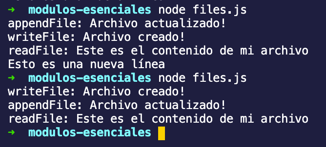

# Ejemplo 1

## Desarrollo

A pesar de que node.js y el navegador ejecutan un mismo estándar de Javascript, Node.js tiene ciertas diferencias marcadas en los objetos globales.

### Objetos globales

Estos objetos o palabras clave, están disponibles en cualquier módulo de node.js

- [Buffer](https://nodejs.org/docs/latest-v12.x/api/globals.html#globals_class_buffer)
- [__dirname](https://nodejs.org/docs/latest-v12.x/api/globals.html#globals_dirname)
- [__filename](https://nodejs.org/docs/latest-v12.x/api/globals.html#globals_filename)
- [clearImmediate(immediateObject)](https://nodejs.org/docs/latest-v12.x/api/globals.html#globals_clearimmediate_immediateobject)
- [clearInterval(intervalObject)](https://nodejs.org/docs/latest-v12.x/api/globals.html#globals_clearinterval_intervalobject)
- [clearTimeout(timeoutObject)](https://nodejs.org/docs/latest-v12.x/api/globals.html#globals_cleartimeout_timeoutobject)
- [console](https://nodejs.org/docs/latest-v12.x/api/globals.html#globals_console)
- [exports](https://nodejs.org/docs/latest-v12.x/api/globals.html#globals_exports)
- [global](https://nodejs.org/docs/latest-v12.x/api/globals.html#globals_global)
- [module](https://nodejs.org/docs/latest-v12.x/api/globals.html#globals_module)
- [process](https://nodejs.org/docs/latest-v12.x/api/globals.html#globals_process)
- [queueMicrotask(callback)](https://nodejs.org/docs/latest-v12.x/api/globals.html#globals_queuemicrotask_callback)
- [require()](https://nodejs.org/docs/latest-v12.x/api/globals.html#globals_require)
- [setImmediate(callback[, ...args])](https://nodejs.org/docs/latest-v12.x/api/globals.html#globals_setimmediate_callback_args)
- [setInterval(callback, delay[, ...args])](https://nodejs.org/docs/latest-v12.x/api/globals.html#globals_setinterval_callback_delay_args)
- [setTimeout(callback, delay[, ...args])](https://nodejs.org/docs/latest-v12.x/api/globals.html#globals_settimeout_callback_delay_args)
- [TextDecoder](https://nodejs.org/docs/latest-v12.x/api/globals.html#globals_textdecoder)
- [TextEncoder](https://nodejs.org/docs/latest-v12.x/api/globals.html#globals_textencoder)
- [URL](https://nodejs.org/docs/latest-v12.x/api/globals.html#globals_url)
- [URLSearchParams](https://nodejs.org/docs/latest-v12.x/api/globals.html#globals_urlsearchparams)
- [WebAssembly](https://nodejs.org/docs/latest-v12.x/api/globals.html#globals_webassembly)

Los siguientes solo existen dentro del sistema de módulos:

- [require()](https://nodejs.org/docs/latest-v12.x/api/modules.html#modules_require_id)
- [module](https://nodejs.org/docs/latest-v12.x/api/modules.html#modules_module)
- [exports](https://nodejs.org/docs/latest-v12.x/api/modules.html#modules_exports)
- [__dirname](https://nodejs.org/docs/latest-v12.x/api/modules.html#modules_dirname)
- [__filename](https://nodejs.org/docs/latest-v12.x/api/modules.html#modules_filename)

Hasta ahora has hecho uso de los primeros dos. En el siguiente ejemplo trabajaremos con archivos y utilizaremos las palabras clave ` __dirname y __filename `

### Core Modules

Los Core Modules (módulos principales) vienen con Node.js y no necesitan ser instalados. Estos proporcionan funcionalidad de bajo nivel y métodos auxiliares. Permiten a Node.js trabajar con el sistema de archivos, redes, datos binarios, flujos de datos (streams), generar procesos externos, rutas de archivos y URLs, y realizar otras tareas útiles, como crear clientes y servidores HTTP(S).

Aquí está el listado de los principales:

- [fs](http://nodejs.org/api/fs.html) - módulo para trabajar con el sistema de archivos.
- [path](http://nodejs.org/api/path.html) - módulo para *parsear* rutas de archivos a través de distintas plataformas.
- [net](http://nodejs.org/api/net.html) - redes y otros protocolos.
- [stream](http://nodejs.org/api/stream.html) - para trabajar con flujos de datos(streams).
- [events](http://nodejs.org/api/events.html) - modulo para implementar *event emitters.*
- [child_process](http://nodejs.org/api/child_process.html) - módulo para generar procesos externos
- [os](http://nodejs.org/api/os.html) - sirve para acceder a la información del sistema operatico, incluyendo la plataforma, número de procesadores, memoria, etc.
- [url](http://nodejs.org/api/url.html) - módulo para procesar URLs.
- [http](http://nodejs.org/api/http.html) - módulo para realizar (cliente) y recibir peticiones (servidor) web.
- [https](http://nodejs.org/api/https.html) - sirve para hacer lo mismo que el anterior, pero para HTTPS
- [util](http://nodejs.org/api/util.html) - utilidades varias
- [assert](http://nodejs.org/api/assert.html) - módulo para realizar pruebas basadas en aserciones.
- [crypto](http://nodejs.org/api/crypto.html) - módulos para cifrar información y crear *hashes*.

Estos módulos no necesitan descargarse o ser instalados. 

ejemplo:

```jsx
const http = require('http') // reemplaza `http` con el módulo principal que quieras utilizar
```

### path.join()

Como Node.js está diseñado para ser multiplataforma y existen diferencias de sintaxis para leer archivos en cada plataforma, path nos permite crear rutas de archivos de manera independiente.

Ejemplo.

1. Vamos a componer una ruta para el archivo `app/server.js`

```jsx
const path = require('path')
const ruta
const server = require(path.join('app', 'server.js')) 
```

2. Ejecuta esto y mira lo que imprime

**Este código nos servirá para obtener la misma ruta en windows y en sistemas operativos basados en UNIX.**

3. Utilizando `__dirname` obtendremos la ruta absoluta, en lugar de una relativa:

```jsx
const path = require('path')
const server = require(path.join(__dirname, 'app', 'server.js')) 
```

4. Ejecuta esto y mira lo que imprime

### FS

`fs` nos permite leer y escribir en el sistema de archivos. Node nos permite realizar esta operación de manera bloqueante o no-bloqueante:

Algunos de los métodos de este módulo son los siguientes:

- `fs.readFile()`: lee archivos de manera asíncrona.
- `fs.writeFile()`: escribe archivos de manera asíncrona.

Y para hacerlo de manera bloqueante existen sus contrapartes:

- `fs.readFileSync()`: lee archivos de manera bloqueante.
- `fs.writeFileSync()`: escribe archivos de manera bloqueante.

### Ejemplo:

1. Crearemos el script `files.js` e importaremos `fs`

    ```jsx
    const fs = require('fs');
    ```

2. Crearemos un archivo utilizando la función `fs.writeFile()`

    ```jsx
    fs.writeFile(path.join(__dirname, '/ejemplo_1.txt'), 'Este es el contenido de mi archivo', {encoding: 'utf-8'}, (err) => {
      if (err) throw err;
      console.log('writeFile:','Archivo creado!');
    });
    ```

3. Para leer el contenido del archivo usaremos la función `fs.readFile()`

    ```jsx
    fs.readFile(path.join(__dirname, '/ejemplo_1.txt'), {encoding: 'utf-8'}, function (error, data) {
      if (error) return console.error(error)
      console.log('readFile:',data)
    })
    ```

4. Podemos escribir sobre nuestro archivo añadiendo una nueva línea con el siguiente código:

    ```jsx
    fs.appendFile(path.join(__dirname, '/ejemplo_1.txt'), '\nEsto es una nueva línea', (err) => {
      if (err) throw err;
      console.log('appendFile','Archivo actualizado!');
    });
    ```

    También podemos utilizar la función `fs.writeFile()` pasando la opción `flag: 'a'` para añadir contenido a un archivo existente.

5. Ejecutaremos el script con el comando `node files.js` 

    

    Cómo puedes observar, si ejecutamos el script varias veces, estas funciones no se ejecutan siempre en el mismo orden. Esto se debe a que las funciones se están ejecutando de manera **no-bloqueante ó asíncrona.**

6. Si queremos que estas funciones a su versión síncrona se ejecuten de manera secuencial haremos algunos cambios:

    ```jsx
    const fs = require('fs')
    const path = require('path')

    fs.writeFileSync(path.join(__dirname, '/ejemplo_1.txt'), 'Este es el contenido de mi archivo', {encoding: 'utf-8'});
    console.log('writeFileSync:','Archivo creado!');

    data = fs.readFileSync(path.join(__dirname, '/ejemplo_1.txt'), {encoding: 'utf-8'})
    console.log('readFileSync:', data)

    fs.appendFileSync(path.join(__dirname, '/ejemplo_1.txt'), '\nEsto es una nueva línea');
    console.log('appendFile:','Archivo actualizado!');
    ```

    6.2. Ejecutaremos el script

    

    Ahora la ejecución será secuencial.

    Es importante comprender la diferencia entre estos dos modos, ya que esto te ayudará a elegir cuál es el mejor según el problema que quieres resolver.