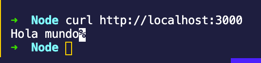

# Ejemplo 3

## Http y Https

### HTTP

El módulo `http` de NodeJS nos da acceso a herramientas y funciones que trabajan con el protocolo HTTP. Con ella podemos crear clientes y servidores web.

1. Empezaremos importando el módulo

    ```jsx
    var http = require("http");
    ```

2. Utilizaremos la función `createServer` para crear nuestro primer servidor

    ```jsx
    var server = http.createServer(function (peticion, respuesta){
       respuesta.end(`<h1>Hola mundo</h1>`);
    });
    ```

3. Para poner en marcha al servidor utilizaremos

    ```jsx
    server.listen(3000, function(){
       console.log("Servidor escuchando en el puerto " + this.address().port);
    });
    ```

4. Ahora guarda este código en el archivo `server.js`
5. Al ejecutarlo nos mostrará el mensaje `Servidor escuchando en el puerto 3000`
6. Para probarlo puedes utilizar el comando `wget [http://localhost:3000](http://localhost:3000)` o accediendo a la url en el servidor 

    

    

### HTTPS

El módulo `https` de NodeJS provee la misma funcionalidad que el módulo `http` pero sobre el protocolo TLS/SSL que nos brinda una capa adicional de seguridad.

Con estos módulos también podemos realizar peticiones a servidores por medio del método `get`

Para el siguiente ejemplo peticionaremos a la [API de la NASA](https://api.nasa.gov/) para obtener información sobre la imagen del día.

1. Copiaremos el siguiente código que utiliza el módulo `https` en el archivo `nasaAPOD.js` 

    ```jsx
    const https = require('https');
    function getAPOD() {
    https.get('https://api.nasa.gov/planetary/apod?api_key=DEMO_KEY', (resp) => {
      let data = '';

      resp.setEncoding('utf8');
      //trozos de información recibida
      resp.on('data', (chunk) => {
        data += chunk;
      });

      // La respuesta completa ha sido recibida. Imprime el resultado
      resp.on('end', () => {
        let body = JSON.parse(data);
        console.log(' Título:',body.explanation);
        console.log('\n Explicación', body.explanation);
        console.log('\n URL:', body.url);
      });

    }).on("error", (err) => {
      console.log("Error: " + err.message);
    });

    getAPOD();

    ```

    Utilizamos el método `get` del módulo `https` para obtener información sobre la imagen del día. Este método recibe como primer parámetro la url, el segundo es un callback con el objeto respuesta y por medio del método `.on` podemos subscribirnos a los eventos de nuestra petición.

2. Ejecutaremos el archivo `nasaAPOD.js`

3. Si todo ha salido bien podrás observar la respuesta de la API con el título, descripción y la url de la imagen:

```bash
➜  cli-apps node nasaAPOD.js
Título: The Milky Way over St Michael's Mount

Explicación: Where do land and sky converge? On every horizon -- but in this case the path on the ground leads to St Michael's Mount (Cornish: Karrek Loos yn Koos), a small historic island in Cornwall, England. The Mount is usually surrounded by shallow water, but at low tide is spanned by a human-constructed causeway.  The path on the sky, actually the central band of our Milky Way Galaxy, also appears to lead to St Michael's Mount, but really lies far in the distance.  The red nebula in the Milky Way, just above the castle, is the Lagoon Nebula, while bright Jupiter shines to the left, and a luminous meteor flashes to the right.  The foreground and background images of this featured composite were taken on the same July night and from the same location. Although meteors are fleeting and the Milky Way disk shifts in the night as the Earth turns, Jupiter will remain prominent in the sunset sky into December.    Moon Occults Mars: Notable images submitted to APOD

URL: https://apod.nasa.gov/apod/image/2009/StMiMo_Hudson_960.jpg
```
### Notas adicionales

Si tienes problemas obteniendo la imagen del día puede ser debido a tu zona horaria, intenta obtener las imágenes anteriores por medio del parámetro fecha de la URL. 

Si tienes problemas obteniendo la imagen del día puede ser debido a tu zona horaria, intenta obtener las imágenes de días anteriores por medio de el parámetro fecha de la URL.

Ejemplo:

```bash
let today = new Date("2020-09-06")
let isoDate = today.toISOString().slice(0,10)
```

Para más información consulta la [API de la nasa en el apartado de *Astronomy Picture of the day*.](https://api.nasa.gov/)
