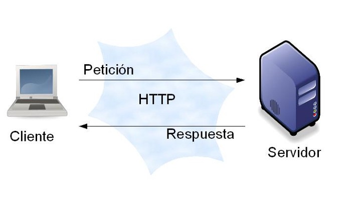

# Prework

### Objetivo

* Entender el por qué de los módulos esenciales de Node.js y en posibles casos de uso.

## Sesión 02

### **Módulos esenciales de Node.js**

Como se ha mencionado anteriormente, con la instalación de Node.js se incluyen módulos que llamaremos **módulos esenciales** y pueden ser utilizados en cualquier parte del código.

A continuación mencionaremos dos módulos esenciales muy importantes.

### **Manipulando Archivos con Node.js**

Con Node JS podemos manipular archivos de manera sencilla, ya sea **subir**, **editar**, **eliminar**, **crear**, etc. un archivo en el servidor, por otro lado también puedes manipular las rutas de los archivos, copiar archivos, obtener una respuesta cuando realices una determinada acción con un archivo en tu servidor, en este artículo te explicaremos las maneras de trabajar con archivos en Node JS.

### Importación del módulo **`fs`**

Igual que hacemos con otros módulos de Node, hay que procesar el correspondiente `require` para tener disponibles las funciones de acceso al sistema de ficheros. Se encuentran en el module llamado `fs` y lo vamos a importar con el siguiente código:

``` jsx
const fs = require('fs');
```

**Nota:** El nombre del objeto para operar con el sistema de archivos lo hemos guardado en una variable llamada fs. Podrías usar el nombre de variable que tú desees. Observa además que en vez de **var** estamos usando **const**, que es la forma más habitual de declarar variables en **ES6**.

## **Crear Archivo**

El método **fs.appendFile()** se usa para agregar **asincrónicamente** los datos dados a un archivo. Se crea un nuevo archivo si no existe. El parámetro de opciones se puede usar para modificar el comportamiento de la operación. 

**Nota**: Si el archivo existe este es reemplazado por el nuevo archivo creado.

**Sintaxis:**

`fs.appendFile( path, data[, options], callback )`

**Parámetros:** este método acepta cuatro parámetros como se mencionó anteriormente y se describe a continuación:

- **path:** Es una **cadena**, **búfer**, **URL** o un número que denota el nombre del archivo fuente o el descriptor de archivo al que se agregará.
- **data:** Es un **String** o **Buffer** que denota los datos que deben agregarse.
- **options:** Es una **cadena** o un **objeto** que se puede usar para especificar parámetros opcionales que afectarán la salida. Tiene tres parámetros opcionales:
    - **encoding:** Es una cadena que especifica la codificación del archivo. El valor predeterminado es 'utf8'.
    - **mode:** Es un número entero que especifica el modo de archivo. El valor predeterminado es '0o666'.
    - **flag:** Es una cadena que especifica la bandera utilizada mientras se agrega al archivo. El valor predeterminado es **a**.
- **callback:** Es una función que se llamaría cuando se ejecuta el método.
    - **err:** Es un error que se lanzaría si el método falla.

**Ejemplo:**

```jsx
fs.appendFile('primer_Archivo.html', 'primerArchivo', (err) => {
  if (err) throw err;
  console.log('Archivo creado satisfactoriamente');
});
```

## Leer Archivo

El método **fs.readFile()** es un método incorporado que se utiliza para leer el archivo. Este método **lee** **todo** el archivo en el **búfer**. Para cargar el módulo `fs` usamos el método **require ()**.

 **Ejemplo 1:**

``` jsx
var fs = require('fs');
```
**Sintaxis:**

`fs.readFile( filename, encoding, callback_function)`

**Parameters:** El método acepta tres parámetros como se mencionó anteriormente y se describe a continuación:

- **filename:** Contiene el nombre del archivo a leer o la ruta completa si se almacena en otra ubicación.
- **codificación:** Contiene la codificación del archivo. Su valor predeterminado es **utf8**
- **callback_function:** Es una función de devolución de llamada que se llama después de leer el archivo. Se necesitan dos parámetros:
    - **err:** Si se produjo algún error.
    - **data:** Contenido del archivo.
- **Return Value:** Devuelve los contenidos / datos almacenados en el archivo o si hubo algún error.

**Ejemplo 2:**

```jsx
fs.readFile('documentos/primer_Archivo.html', (err, data) => {
  if (err) throw err;
  console.log(data);
});
```

## Actualizar Archivo

Podemos actualizar el contenido de un archivo con la función **fs.writeFile()** , también puedes usar **fs.appendFile()** según lo que creas te sea conveniente, primero le indicamos que archivo es el que debe actualizar y luego le pasamos el contenido que va a actualizar en el archivo.

```jsx
fs.writeFile('segundo_Archivo.html', 'segundoArchivo', (err) => {
  if (err) throw err;
  console.log('Archivo actualizado Satisfactoriamente');
});
```

## Renombrar Archivo

El método **fs.rename()** se utiliza para cambiar el nombre **asincrónico** de un archivo en la ruta anterior dada a una ruta nueva dada. **Sobreescribirá** el archivo de destino si ya existe.

**Sintaxis:**

`fs.rename (oldPath, newPath, callback)`

**Parameters:** Este método acepta tres parámetros como se mencionó anteriormente y se describe a continuación:

- **oldPath:** Contiene la ruta del archivo que debe **renombrarse**. Puede ser una cadena, búfer o URL.
- **newPath:** Contiene la nueva ruta de acceso al nombre del archivo. Puede ser una cadena, búfer o URL.
- **callback:** Es la función que se llamaría cuando se ejecuta el método. Tiene un argumento opcional para mostrar cualquier error que ocurra durante el proceso.

```jsx
fs.rename('/documento/segundo_Archivo.html', '/documento/tercer_Archivo.html', (err) => {
  if (err) throw err;
  console.log('Archivo renombrado');
});
```

## Eliminar Archivo

El método **fs.unlink ()** se usa para eliminar un archivo o enlace simbólico del sistema de archivos. **No funciona** en directorios, por lo tanto, se recomienda usar **fs.rmdir ()** para eliminar un directorio.

**Sintaxis:**

`fs.unlink( path, callback )`

**Parámetros:** este método acepta dos parámetros como se mencionó anteriormente y se describe a continuación:

- **path:** Es una cadena, búfer o una URL que representa el archivo o enlace simbólico que debe eliminarse.
- **callback:** Es una función que se llamaría cuando se ejecuta el método.
    - **err:** Es un error que se lanzaría si el método falla.

Sintaxis:

```jsx
fs.unlink('/documentos/segundo_Archivo.html', (err) => {
  if (err) throw err;
  console.log('Archivo eliminado satisfactoriamente');
});
```

# Cómo crear un servidor web en Node.js con el módulo HTTP

.png)

Cuando visualizamos una página web en un navegador, está realizando una solicitud a otro equipo en Internet, que a continuación proporciona la página web como respuesta. Esa computadora con la que está hablando a través de Internet es un **servidor web**. Un servidor web recibe **solicitudes HTTP** de un **cliente**, como su **navegador**, y proporciona una respuesta **HTTP**, como una página **HTML** o **JSON** desde una **API**.



Para que un servidor devuelva una página web, se emplea una gran cantidad de software. Este software generalmente se divide en dos categorías: frontend y backend. El código **front-end** se refiere a cómo se presenta el contenido, como el color de la barra de navegación y el estilo de texto. El código **back-end** se encarga de la forma en la que los datos se intercambian, procesan y almacenan. El código que administra las solicitudes de red desde su navegador o se comunica con la base de datos lo gestiona principalmente el código **back-end.**

**Node.js** permite a los desarrolladores usar **JavaScript** para escribir código **back-end**, aunque tradicionalmente se usaba en el navegador para escribir código front-end. Al tener el frontend y el backend juntos de esta forma, se reduce el esfuerzo necesario para crear un servidor web, que es el motivo principal por el que Node.js es una opción popular para escribir código back-end.

## Crear un servidor HTTP básico

Si nos vamos a la definición de HTTP podríamos afirmar que es un protocolo de red. Ahora bien, **¿Qué es un protocolo de red?**

> Un protocolo de red se define como un conjunto de reglas y permisos para establecer la comunicación entre dispositivos. Además se encarga de la configuración de la conexión, es decir cómo y de qué forma se va a actuar.

**HTTP**( Protocolo de Transferencia de Hipertexto) es el protocolo por excelencia de la web. Se utiliza para todo tipo de transacción, como por ejemplo que el navegador pida una página o recurso a un servidor y que éste responda.


Por lo tanto, como se muestra en el gráfico, el cliente, que puede ser nuestro navegador web, envía una petición por la URL, el servidor procesa ese pedido y devuelve la respuesta correspondiente.

En el caso de Node.Js, debemos **configurar manualmente** su comportamiento, es decir, no es como **Php+Apache** que ya trae un conjunto de configuraciones y comportamientos previos listos para usar. En Node.Js tenemos la tarea de configurarlo por nuestra cuenta .

Lo primero que vamos a hacer es crear un archivo con el nombre de app.js y, una vez dentro, vamos a requerir un módulo del core de Node llamado http.

```jsx
const http = require('http');
```

`http` es un módulo que ya viene con node, por lo tanto no debemos instalarlo con npm o otro gestor.

Luego crearemos dos variables, una para el `host` y otra para el `puerto`, ya que el servidor necesitará de estos datos.

```jsx
const host = '127.0.0.1';
const port = 3000;
```

Vamos a correr nuestro servidor en nuestra máquina local, por lo tanto con la variable **host** nos vamos a referir a **localhost** usando su dirección **IP** que es **127.0.0.1**, y por convención, vamos a correr nuestro servidor en el puerto **3000**.

Lo próximo que vamos a hacer es llamar al método **createServer** que devuelve una nueva instancia de **http.Server.**

```jsx
const server = http.createServer((req, res) => {
  res.statusCode = 200;
  res.setHeader('Content-Type', 'text/plain');
  res.end('Primer servidor con Node.Js');
});
```

Al método **createServer** le pasamos un **callback** con dos parámetros **req** y **res** .

**req** es la petición que le hacemos al servidor, en sí, es un objeto que tiene toda la información de la petición, y **res** de la respuesta. Por lo tanto establecemos el código **200** (HTTP 200 = exitoso), los **headers** (cabeceras de contenido) y para finalizar cerramos la conexión con un mensaje.

Luego vamos a llamar al método **listen** que hará la magia de concretar la conexión.

```jsx
server.listen(port, host, () => {
  console.log(`Servidor corriendo en http://${host}:${port}`);
});
```

El método **listen** recibe el puerto, el **host** y un **callback** en donde le pasamos el mensaje una vez que la conexión se abra.

Por último, una vez dentro de nuestro proyecto/carpeta, mediante la consola, llamamos al archivo.

```bash
$ node app.js
Servidor corriendo en http://127.0.0.1:3000
```

## Resultado Final

