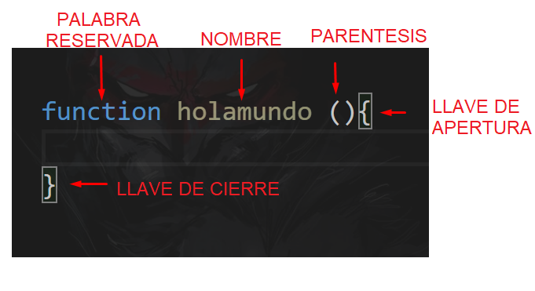
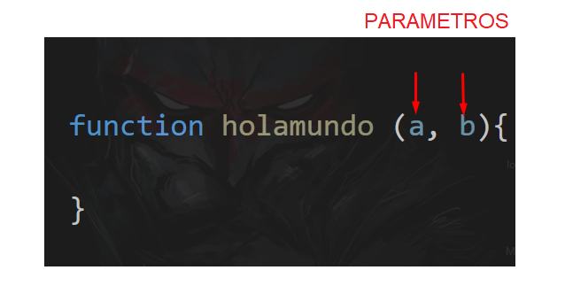
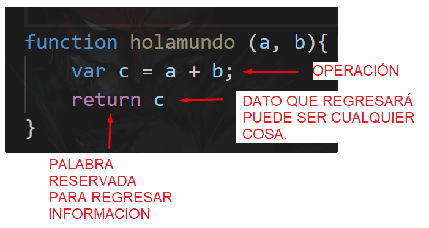
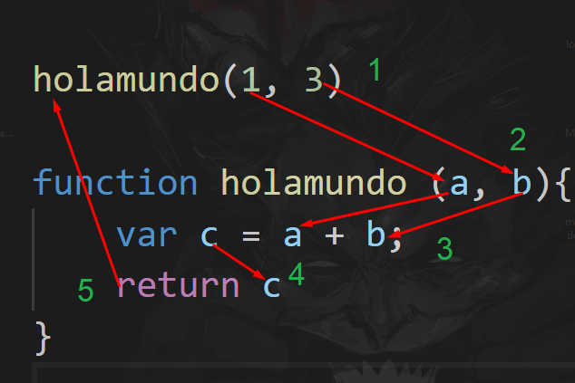
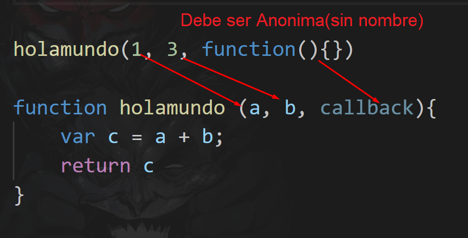
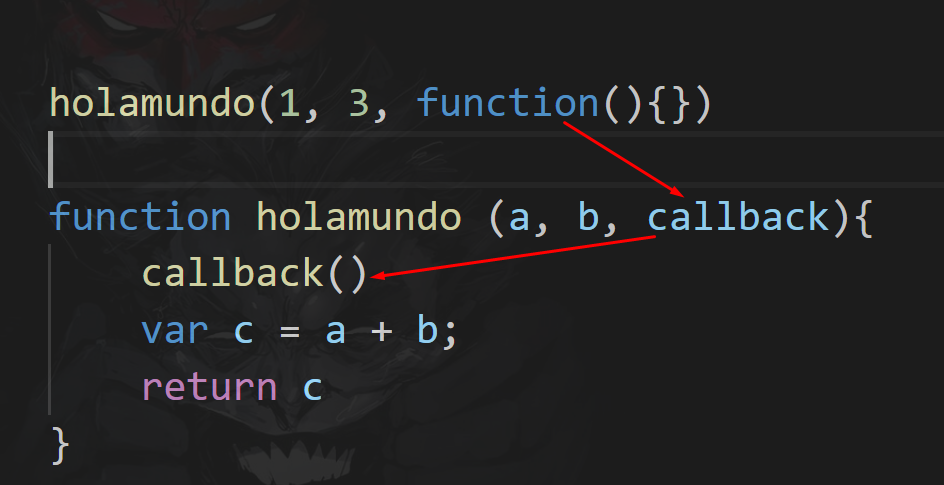
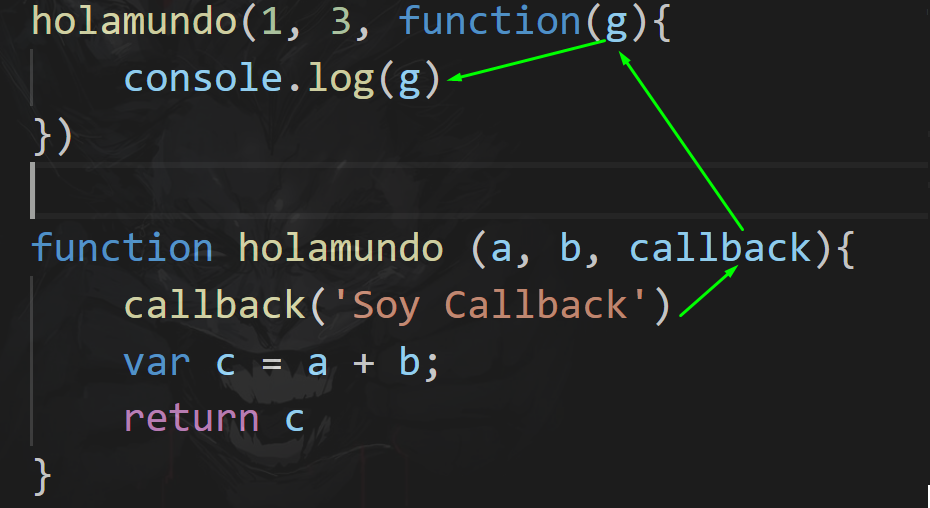

# Ejercicio 1

## 👮 !Advertencia! Es muy importante que para esta actividad tengas un alto grado de concentración, por ello te hacemos las siguientes recomendaciones: evita lugares con distracciones, trata de esta lo más cómodo posible, elimina las distracciones de tu ordenador, pon en modo silencio tu celular, ya que esta clase requiere de un alto nivel de atención para su entendimiento. 

<br>
<br>
<br>
<br>
<br>

## Objetivo

Comprender el modelo asíncrono y no bloqueante de Javascript y la importancia de los callbacks en la asincronia.

## Requerimientos

Instalación de Node 

## Desarrollo

### ¿Qué es un callback?

En Javascript un **Callback** , es aquella función que se envia como parámetro a otra función.


Vamos a entender esto por partes, una función es una estructura en código que permite un envio, una entrada y una salida de datos.


### Veamos primero el proceso de entrada y salida de datos:

En javascript una función se declara de la manera siguiente : 




Cuando decimos que una función tiene entradas y salidas, hablamos de que cuando le envio cosas, la funcion recibira esa información a traves de parámetros.





Estos parametros pueden ser utilizados para realizar acciones dentro de la función.




y despues puede retornar algo, es decir, regresar información del proceso que se ha enviado, pero tambien tiene la opción de no regresar nada. 


En resumen, los datos entran a la función a traves de los parametros, dentro de la función podemos hacer cualquier cosa que querramos con esos datos y podriamos regresar un resultado o no.


### Ahora veamos la parte de envio de datos.


Para encender o accionar una función necesitamos usar el nombre de la funcion junto con un par de paréntesis.


en los paréntesis podemos enviar información a la función, **SEPARADOS POR COMAS**, o podemos dejarlo vacío.

Eso quiere decir que el ciclo de vida de la funcion es esl siguiente : 




1. Mando llamar la funcion y envio parámetros
2. La funcion recibe y guarda lo que el llamado envio en variables(a,b)
3. Realizo una operación o cualquier cosa con los datos que llegaron dentro de la función
4. Guardo los datos en una variable y los preparo para regresarlos.
5. Regreso la información al llamado.

Hasta este momento todo lo que hemos entendido es el ciclo de vida de la función, ahora veremos como funcionan los callbacks.

En la misma función enviare un tercer parámetro, pero este, sera otra función :



Cuando envio una función como parámetro debe ser anonima, cuando hago esto, la función que recibe el parámetro con la función anonima, puede mandarla llamar desde adentro y hacer algo totalmente diferente.   

Eso quiere decir que si sigo con las reglas de las funciones, entonces para mandar llamar la función anonima, tengo que usar el nombre del parámetro  + paréntesis.



Entonces ya puedo hacer uso de la función anonima dentro de mi función holamundo.

Puedo accionar la funcion callback en cualquier parte del proceso de mi función holamundo, como si fuera una función común y corriente. 





### ¿Por qué necesitamos callbacks?

La asincronia de javascrit y node.js tiene ventajas sobre sus competidores, por que realiza las acciones o tareas al mismo tiempo, pero al hacer esto, perdemos el control de la espera en una ejecución.

Tal ves queremos que javascript se espere a que termine un proceso para poder continuar con el otro.

Para no romper el paradigma de la asincronia, utilizamos los callbacks y le decimos a javascript que espere...


Veamos, el siguiente ejemplo:

```jsx
function primero() {
  console.log("Soy el 1");
}

function segundo() {
  console.log("Soy el 2");
}

function tercero() {
  console.log("Soy el 3");
}

primero();
segundo();
tercero();
```
RESUTADO

```bash
Soy el 1
Soy el 2
Soy el 3
```


Tenemos el resultado que esperabamos se ejecuta *primero*, luego *segundo* y por último *tercero*

Ahora, supongamos que *primero* es una función que hace una petición *http* a una base de datos con mucha informcón y tenemos que esperar por la respuesta de la petición, para simular esto, usaremos *setTimeout* adaptando el código anterior

```jsx
function primero() {
  //Simula petición a un servidor con muchos datos
  setTimeout(function () {
    console.log("Soy el 1");
  }, 1000);
}

function segundo() {
  console.log("Soy el 2");
}

function tercero() {
  console.log("Soy el 3");
}

primero();
segundo();
tercero();
```

RESULTADO

```bash
Soy el 2
Soy el 3
Soy el 1
```

Por ahora, no es necesario entender el funcionamiento de *setTimeout* sólo que en nuestro ejemplo simula una petición a una API creando un retardo de *1 seg*. 

El resultado no está en el orden en el mandamos a llamar a las funciones, lo que sucede es que Javascript no ha esperado a la respuesta *primero* para avanzar. En este ejemplo es importante esperar por la respuesta antes de avanzar en el código, ya que tendremos que saber si la petición sucedió con éxito o no, en caso de no hacerlo lo más lógico sería manejar el error.

Javascript utiliza un modelo **asíncrono y no bloqueante con un loop de eventos con un sólo hilo de ejecución.** Para que Javascript funcione de manera asíncrona existen los siguientes mecanismos que trataremos en esta sesión:

- Callbacks
- Promises
- Async / await

### Callbacks

Como lo hemos dicho anteriormente, un callback no es más que una función que pasa como argumento a otra función y es utilizado como un **modo para asegurar que cierto código no se ejecute hasta que otro código haya terminado de ejecutarse.**

### Callback Hell

Los callbacks también pueden lanzar a su vez funciones asíncronas, lo que hace que pueda anidarse tanto como se desee

Podríamos tener un ejemplo cómo el siguiente:

```jsx
setTimeout(function () {
  console.log("Soy el 1");
  setTimeout(function () {
    console.log("Soy el 2");
    setTimeout(function () {
      console.log("Soy el 3");
      setTimeout(function () {
        console.log("Soy el 4");
        // Podría a ver más llamadas asíncronas
      }, 4000);
    }, 3000);
  }, 2000);
}, 1000);
```

```bash
Soy el 1
Soy el 2
Soy el 3
Soy el 4
```

Si se implementará más llamadas anidadas, sin duda tenemos una problemática de identación, legibilidad, dificulta el mantenimiento, etc., a esto se le conoce como **Callback Hell** o también **Pyramid of Doom**.

El siguiente post muestra este problema ya descrito y también a cómo solucionarlo, es una guía introductoria a lo que será el resto de la sesión

[Callback Hell](http://callbackhell.com/)