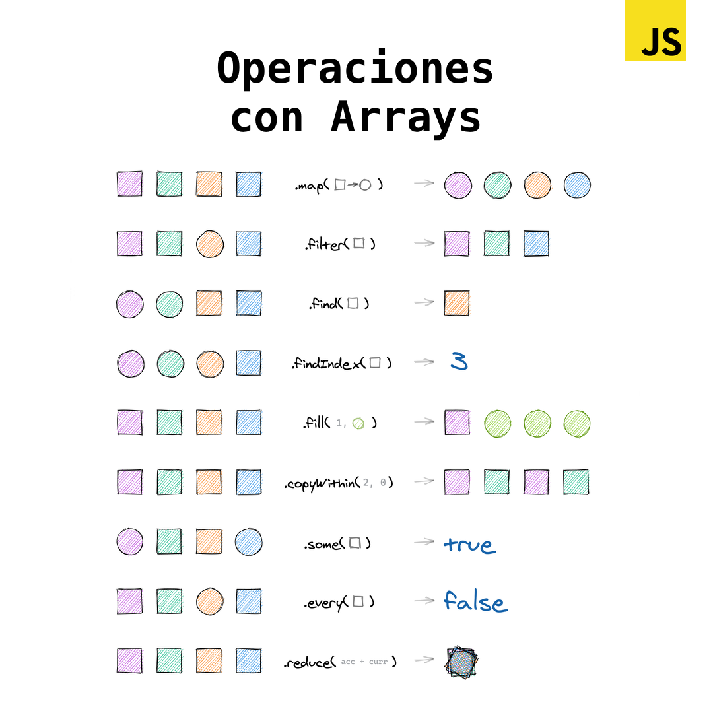

# Postwork

### Requisitos

* Tener Node instalado.

### Objetivo

* Conocer alternativas importantes que ayudarían a crear mejor código según sea la necesidad

## Sesión 03

### Generadores

Un generador es un proceso que puede pausarse, reanudarse y producir varios valores. Los generadores pueden mantener el estado y proporcionar con ello una forma eficiente de crear iteradores, y encargarse de flujos de datos infinitos que se pueden emplear para implementar desplazamiento infinito, también, se puedan usar con **promesas**, los generadores pueden imitar la funcionalidad de **async/await**, lo que permite utilizarlo como mecanismo asíncrono.

El siguiente tutorial puede ayudar a entender mejor los generadores con varios ejemplo, también, a cómo utilizar esta potente característica de JavaScript cuya ejecución puede detenerse y reanudarse.

[Información sobre generadores en JavaScript | DigitalOcean](https://www.digitalocean.com/community/tutorials/understanding-generators-in-javascript-es)

**¿Qué son los generadores?**

[¿Qué son los generadores en Javascript?](https://www.youtube.com/watch?v=tEkWs8RCkQQ)

**Un ejemplo interesante "Generador infinito asíncrono"**

[JavaScript Zero | Episodio 35.1: Generador Infinito Asíncrono](https://www.youtube.com/watch?v=xb9CYd3HgIs)

### Operaciones con array

Si haz trabajado lo necesario con Javascript, incluso otros lenguajes de programación te habrás dado cuenta de la importancia de usar arreglos y con ello sus métodos de instancia, sin duda, han ahorrado trabajo al implementar código y por supuesto estos métodos están optimizados para utilizarlos de la mejor manera. Como se ha visto en esta sesión al hacer peticiones a una API se ha trabajado con arreglos para ordenar los resultados o para juntar los resultados pero supongamos que tenemos ciertas peticiones en un arreglo y queremos utilizar paralelismo con **promesas** y a su vez utilizar **async/await** para esperar los resultados para ir por todos esos resultados, se podría hacer con un for..loop pero hay otras opciones interesantes que se pueden explorar. La siguiente imagen podría ayudar a que conozcas más sobre el uso de estos métodos en diferentes problemas:

Esta documentación es útil para conocer todas las operaciones anteriores:

[Array](https://developer.mozilla.org/es/docs/Web/JavaScript/Referencia/Objetos_globales/Array)