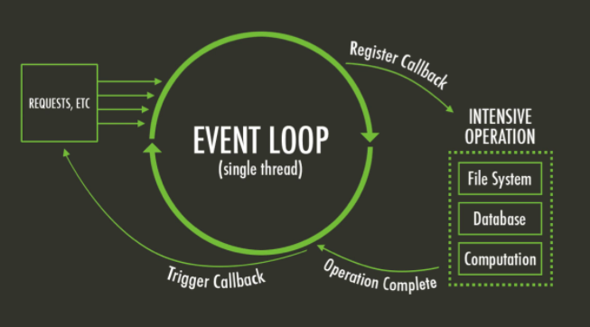

# Prework

## **¿QUÉ ES LO QUE NODEJS TIENE DE DIFERENTE A OTROS LENGUAJES DE PROGRAMACIÓN?**

Bueno, Node tiene algo muy distintivo de los demás. El cual es trabajar con un **solo hilo**. Si tienes tiempo programando con otros lenguajes, sabrás que muchos de ellos pueden usar más de un hilo. Esto se debe a que un lenguaje como **Java**, se ejecuta de manera secuencial y cuando encuentra un proceso que lleva mucho tiempo para ejecutarse, el programa debe esperar forzosamente a que el proceso termine para seguir ejecutando todo el código que hay después de él.

Eso, de alguna manera se puede solucionar, creando nuevos hilos y hacer que ciertas tareas se ejecuten en segundo plano para continuar con la ejecución del programa.

Pues, aquí es donde entra Nodejs y lo innovador que tiene. Cosas como el ***Event loop**, **Call Stack**, **Programación Asíncrona**, **Callbacks**, etc.* Todos estos son conceptos en común que son la base del funcionamiento de Nodejs y creo que es indispensable saber cómo y porqué trabaja de esta manera. Así, podremos sacarle el máximo provecho a la herramienta y escribir un mejor código.

Bueno, empecemos ahora por explicar como trabaja Nodejs.

Como mencione anteriormente, Node, trabaja con un solo hilo. Esto significa que solo **ejecutará un proceso a la vez.**

Como desarrolladores de Javascript debemos tener mucho cuidado al programar de no bloquear este único hilo. Aquí entra la parte de **Blocking** y **Non-Blocking**.

## Asincronía

La **asincronía** es uno de los pilares fundamentales de *Javascript*, ya que es un lenguaje de programación de un sólo **subproceso** o **hilo** (*single thread*), lo que significa que sólo puede **ejecutar una cosa a la vez**.

Si bien los lenguajes de programación de un sólo hilo **simplifican la escritura** de código porque no tiene que preocuparse por los **problemas** de **concurrencia**, esto también significa que **no** puede **realizar operaciones largas** como el acceso a la red sin bloquear el hilo principal.

Imagina que solicitas datos de una *API*. Dependiendo de la situación, el servidor puede tardar un tiempo en procesar la solicitud mientras bloquea el hilo principal y hace que la página web no responda.

Ahí es donde entra en juego la asincronía que permite realizar largas solicitudes de red sin bloquear el hilo principal.

*JavaScript* fue diseñado para ser ejecutado en navegadores, trabajar con peticiones sobre la red y procesar las interacciones de usuario, al tiempo que mantiene una interfaz fluida.

***Javascript*** usa un **modelo** **asíncrono** y **no bloqueante**, con un ***loop*** de **eventos** implementado en un solo hilo, (***single thread***) para operaciones de entrada y salida (***input/output***).

Gracias a esta solución, *Javascript* es altamente concurrente a pesar de emplear un solo hilo.



Antes de explicar como funciona el modelo de JavaScript es importante entender algunos conceptos:

- Procesamiento Single thread (Hilo único) y Multi thread (Hilos múltples).
- Operaciones de CPU y Operaciones de I/O (Entrada y Salida).
- Operaciones Concurrentes y Paralelas.
- Operaciones Bloqueantes y No Bloqueantes.
- Operaciones Síncronas y Asíncronas.

## Single thread y Multi thread

Un **hilo** la unidad básica de **ejecución de un proceso**, cada que abres un programa como el navegador o tu editor de código, **se levanta un proceso en tu computadora** e internamente este puede tener **uno** o **varios** hilos (threads) ejecutándose para que el proceso funcione.

## Operaciones de CPU y de Entrada y Salida

- **Operaciones CPU:** Aquellas que pasan el mayor tiempo consumiendo Procesos del CPU, **por ejemplo**, la escritura de ficheros.
- **Operaciones de Entrada y Salida:** Aquellas que pasan la mayor parte del tiempo esperando la respuesta de una petición o recurso, como la solicitud a una **API** o **BD**.

## Concurrencia y Paralelismo

### **Concurrencia:**

La concurrencia es la capacidad de un procesador para simular la ejecución de múltiples programas al mismo tiempo. El CPU ejecuta bloques pequeños de instrucciones de un programa de manera tan rápida que ante nuestros ojos parece que todos los programas de nuestra computadora son ejecutados al mismo tiempo.


### **Paralelismo:**

El paralelismo es la capacidad de ejecutar programas de manera simultanea. A diferencia de la concurrencia, el paralelismo es realmente ejecutar múltiples cosas al mismo tiempo. Hoy en día esto es posible gracias a que nuestras computadoras y dispositivos móviles tienen **cores**, que son múltiples procesadores.


## Bloqueante y No Bloqueante

Se refiere a como la **fase de espera** de las operaciones afectan a nuestra aplicación:

- **Bloqueante:** Son operaciones que **no devuelven** el control a nuestra aplicación hasta que se ha **completado**. Por tanto el **thread** queda bloqueado en estado de espera.
- **No Bloqueante:** Son operaciones que **devuelven** **inmediatamente** el control a **nuestra aplicación**, independientemente del resultado de esta. En caso de que se haya completado, devolverá los datos solicitados. En caso contrario (si la operación no ha podido ser satisfecha) podría devolver un **código de error.**

## Síncrono y Asíncrono

-Se refiere a **¿cuándo tendrá lugar la respuesta?:**

- **Síncrono:** La respuesta sucede en el presente, una operación síncrona esperará el resultado.
- **Asíncrono:** La respuesta sucede a futuro, una operación asíncrona no esperará el resultado.

**Con lo anterior en JavaScript podemos tener:**

- Código síncrono y bloqueante o
- Código asíncrono y no bloqueante

### ***JavaScript* Síncrono**

Cada operación se hace de una vez, bloqueando el flujo de ejecución, el hilo es bloqueado mientras espera la respuesta, cuando esta se procesa pasa a la siguiente operación y así sucesivamente al terminar todas las operaciones.

```bash
console.log("Inicio");

function dos() {
  console.log("Dos");
}

function uno() {
  console.log("Uno");
  dos();
  console.log("Tres");
}

uno();
console.log("Fin");

//Salida

Inicio
Uno
Dos
Tres
Fin
```

### ***JavaScript* Asíncrono**

Cada operación se ejecuta y devuelve inmediatamente el control al hilo, evitando el bloqueo, cuando cada operación termine se enviará una notificación de que ha terminado, es entonces cuando la respuesta se encolará para ser procesada.

```bash
console.log("Inicio");

function dos() {
  setTimeout(function () {
    console.log("Dos");
  }, 1000);
}

function uno() {
  setTimeout(function () {
    console.log("Uno");
  }, 0);
  dos();
  console.log("Tres");
}

uno();
console.log("Fin");

//Salida
Inicio
Tres
Fin
Uno
Dos
```

## Mecanismos asíncronos en JavaScript

Para controlar la asincronía, JavaScript cuenta con algunos mecanismos:

- Callbacks.
- Promises.
- Async / Await.

### ***Callbacks***

Un ***Callback*** (llamada de vuelta) es una función que se ejecutará **después** de terminar una acción determinada (por ejemplo descargar una imagen, consultar recursos externos, realizar consultas a bases de datos).

Es un mecanismo para asegurar que cierto código **no se ejecute** hasta que otro haya terminado.

Al ser *JavaScript* un lenguaje orientado a eventos, las *callbacks* son una **buena técnica** para controlar la asincronía, sin embargo… *[Callback Hell*](http://callbackhell.com/) .

**El temido Callback Hell o Pyramid of Doom**


```bash

```

Por suerte esto se ha podido resolver utilizando librerías como [async](https://www.npmjs.com/package/async), o empleando promesas con librerías como [Q](https://www.npmjs.com/package/q).

### ***Promises***

Una promesa es un objeto que representa el resultado de una **operación asíncrona** y tiene 3 estados posibles:

1. Pendiente.
2. Resuelta.
3. Rechazada.

Tienen la particularidad de que se pueden **encadenar** (*then*), siendo el resultado de una promesa, los datos de entrada de otra posible función.

Las promesas mantienen un código **más legible** y **mantenible** que las ***callbacks***, además tienen un mecanismo para la **detección de errores** (*catch*) que es posible usar en cualquier parte del flujo de datos.

### **Async / Await**

Las promesas fueron una gran **mejora respecto a las *callbacks*** para controlar la **asincronía** en *JavaScript*, sin embargo pueden llegar a ser muy verbosas a medida que se requieran más y más ***.then()*.**

Las **funciones asíncronas** (*async / await*) surgen para simplificar el manejo de las promesas.

La palabra ***async*** declara una función como asíncrona e indica que una promesa será automáticamente devuelta.

Podemos declarar como *async* funciones con nombre, anónimas o funciones flecha.

La palabra ***await*** debe ser usado siempre dentro de una función declarada como *async* y esperará de forma asíncrona y **no bloqueante** a que una promesa se resuelva o rechace.

## EVENT LOOP

El event loop es el que se encarga de implementar las operaciones asíncronas o el non-blocking. El event loop corre en el único hilo que existe en Node y como mencionamos anteriormente, al bloquear el único hilo de node, estamos bloqueando el event loop.

**Tip:

Libuv** (una librería escrita en C), es el que permite que el event loop funcione y todo el comportamiento asíncrono en Node. Puedes conocer más sobre esta librería ingresando a su [sitio oficial](https://libuv.org).

## **CALL STACK**

Cada vez que una función va a ser ejecutada pasa por el call stack. Como ya sabemos, al trabajar con operaciones asíncronas, estas poseen callbacks, que se ejecutarán una vez el proceso de la operación haya terminado y que se irán añadiendo al callback queue.

## **CALLBACK QUEUE**

Aquí se agregan los callback o funciones que se ejecutan una vez las operaciones asíncronas hayan terminado. Se utiliza el método FIFO (first input, first output), traducido, primero en entrar, primero en salir.

El event loop es el que se encarga de revisar que el call stack este vacío para añadir lo que está dentro del callback queue y ejecutarlo. Mostraré lo anteriormente mencionado con un ejemplo de código para lograr entender de una mejor manera el trabajo del event loop. 😉

```jsx
1 const fs = requiere ('fs')
2
3 fs.readFile(`${__dirname}/user.json`, function callback(err, file){
4	setTimeout(function timeout2(){
5		console.log(JSON.parse(file));
6	}, 4000);
7 })
8
9 console.log('Hello Event Loop');
10
11 setTimeout(function timeout(){
12	console.log("Hi, I'm executed")
14 }, 5000)
```

**Brevemente te explicaremos que hace el snippet de código mostrado.**

- **Línea 1:** Obtenemos la librería File System de Nodejs para poder leer un archivo del disco duro.
- **Línea 3:** Implementamos la operación asíncrona readFile, el cual recibirá como parámetros la ruta del archivo y el callback.
- **Línea 4:** Se encuentra un timer, en este caso, setTimeout la cual es una operación asíncrona y posee una función llamada **timeout2** que se ejecutará después de 4 segundos.
- **Línea 9:** Operación síncrona que imprimirá en consola el mensaje correspondiente.
- **Línea 11:** Un timer que posee una función llamada timeout que se ejecutará después de 5 segundos. Ahora si puedes, piensa por un momento, cómo crees que será el orden en que se va a ejecutar este código y cuál será el orden en el que se imprimirá en consola.

**Bueno, pasemos a explicar todo el trabajo que Nodejs hace para correr el programa que escribimos.**


Primeramente, se agrega la operación **readFile** al **call stack**, debido a que es la primera del programa. Al ser una **operación asíncrona**, esta se mueve a la sección de APIs donde ahí esperaremos a que las herramientas encargadas hagan lo necesario para completar la tarea.


El programa estará esperando a que el archivo termine de leerse, pero él continuará con la **ejecución del programa**. En este caso, se encuentra una **operación síncrona** (se ejecuta de manera muy rápida) que **imprime** en consola el mensaje.


Ahora, vemos que la operación de **leer el archivo** terminó. Por lo tanto, pasa al **callback** **queue**. También, vemos que en el **call stack** se encuentra un **timer**. Esto porque es lo que esta después del `console.log` anterior.


El **timer** posee una función llamada **timeout** que se va a ejecutar después de **5 segundos** e imprimirá en **consola** un **mensaje**. Por ello, pasa a la **sección de APIs** y espera los **5 segundos**. 

Ahora, el **event loop** revisa si esta vacío el **call stack** para ejecutar el **callback** de la operación **readFile**.


Al ejecutar el **callback** de la operación **readFile** nos encontramos con otra operación asíncrona. Un **timer**, con una **función llamada timeout2**, la cual se ejecutará dentro de **4 segundos**. Seguimos esperando a que pasen los **5 segundos del primer timer**.


Se agrega la función **timeout2** a la sección de **APIs** a esperar que los segundos pasen.


Podemos observar que la función **timeout2** ya **terminó** su tiempo. Por lo tanto, pasa al **callback queue**  y como el **call stack** no contiene ninguna operación en ejecución, lo ejecuta.


Se ejecuta el **callback** de la **funcion timeout2**, el cual imprime en consola el archivo en formato **JSON**. También, vemos que la operación **timeout** culminó y se agrega al **callback** **queue**.


Finalmente, el event loop vuelve a revisar el call stack y ejecuta el callback de la función que estaba en el callback queue.

Al no encontrar nada más el **event loop** dentro del **call stack**, el programa se acaba. El resultado final del programa sería el siguiente:

```jsx
// Hello Event Loop
// {name: Fernando Hernández, age: 21}
// Hi, I'm executed
```

---

La documentación [oficial de nodejs](https://nodejs.org/en/docs/guides/event-loop-timers-and-nexttick/) será tu mejor amiga por si tienes dudas acerca de un tema en particular.

-