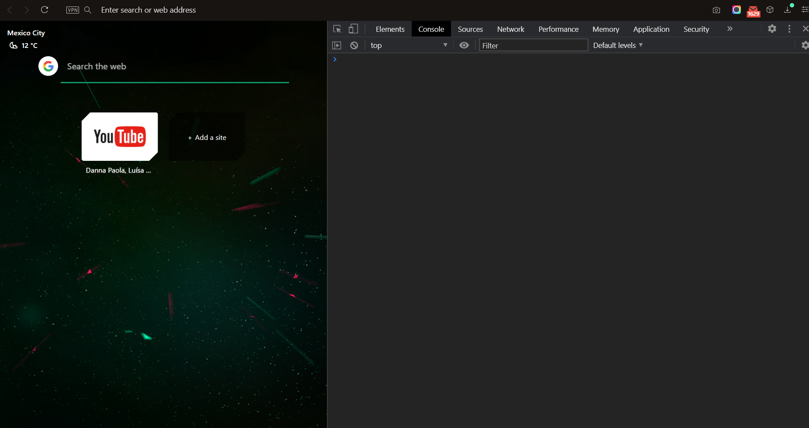
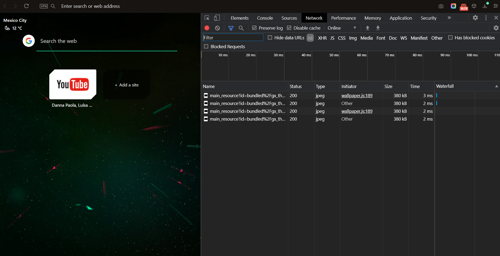
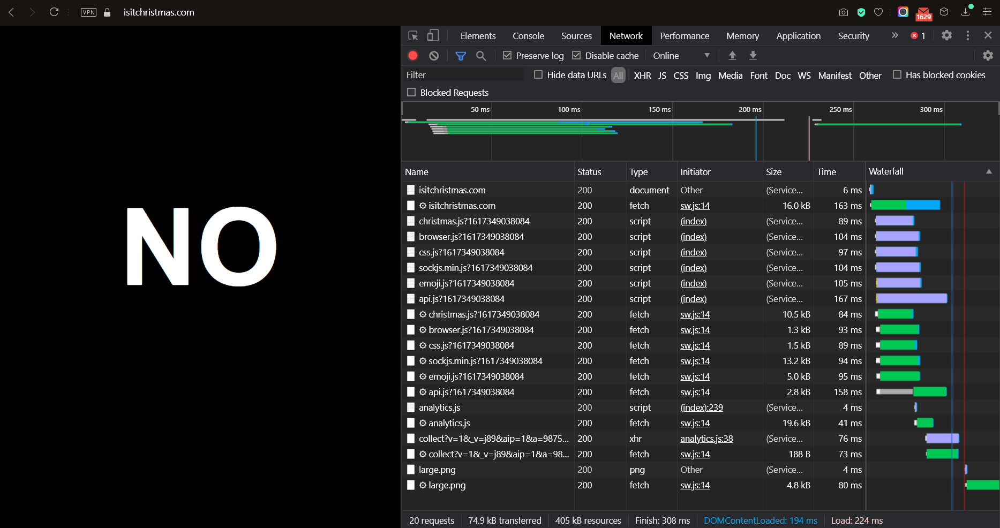
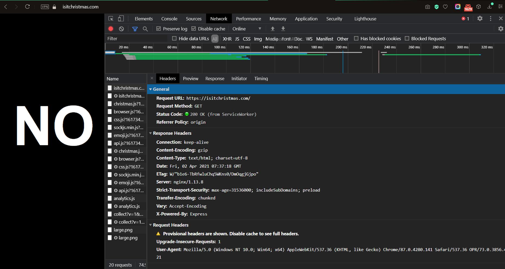
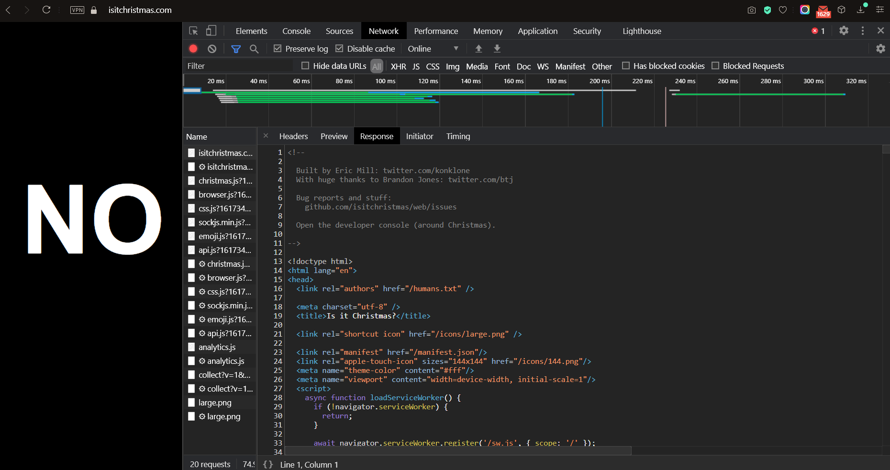

# Ejemplo 1

## Objetivo

Analizar las peticiones HTTP a través del navegador.

## Desarrollo

* Abre tu navegador favorito. Para este ejemplo, las capturas serás de Opera GX.

* Abre las **herramientas de desarrollador** de tu navegador. Dependiendo tu navegador puedes hacerlo de la siguiente manera:

  + **Google Chrome / Opera:** Presiona `ctrl` + `shift` + `J`.

  + **Firefox:** Presiona `ctrl` + `shift` + `Z`.

  + **Microsoft Edge / Internet Explorer:** Presiona `f12`.

* Selecciona la pestaña de `Network / Red`.

* Con las **herramientas de desarrollador** abierta ingresa a la página de [Is It Christmas](https://isitchristmas.com).

* En las **herramientas de desarrollador** encontrarás secciones para analizar el **HTTP Request** (en `Google Chrome / Opera` lo encontrarás como _Headers_) y el **HTTP Response** (en `Google Chrome / Opera` lo encontrarás como _Response_).

