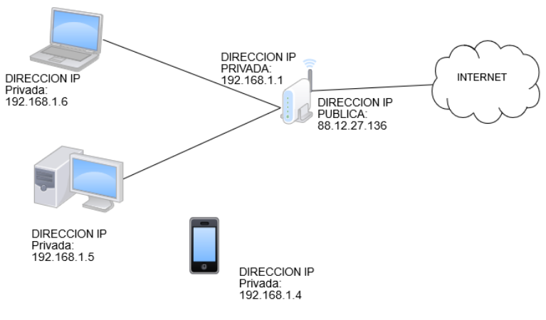
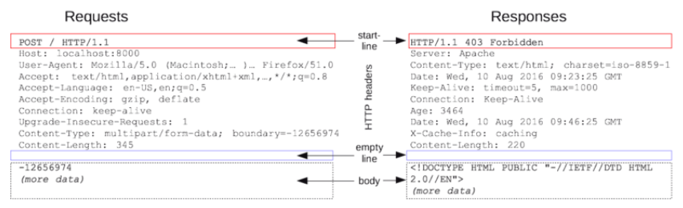

# PREWORK

### OBJETIVO

* Comprender la definición y el funcionamiento del protocolo HTTP que se utiliza como base para desarrollar un back-end.

## Sesión 04

### **El internet es HTTP**

El protocolo HTTP es uno de los más importantes de todos los tiempos, ya que definió la manera en la que dos dispositivos se pueden comunicar a través de internet.

Lanzado en el año 1991, el protocolo HTTP establece que dos dispositivos pueden comunicarse a través del envío de mensajes con una estructura bien definida.

Antes de continuar con los detalles de los mensajes, es necesario comprender cómo podemos establecer comunicación entre dos dispositivos conectados a internet en primer lugar.

### **Protocolo TCP/IP**

El protocolo **TCP/IP** fue creado en el año de 1973 y establece que dos dispositivos conectados a una red se comunican a través de su **dirección IP**. La dirección IP identifica de manera única a un dispositivo en una red y este es establecido en el momento que el dispositivo entra a la red.

**La red más grande conocida hasta la fecha es internet,** por lo que nuestras computadoras, celulares, televisores y cualquier aparato con acceso a internet tiene asignada una dirección IP.
Las direcciones IP es una secuencia de 4 números separados por un punto (.) que va de un rango de 0 a 255. Por ejemplo: **197.240.0.5.**

### **Protocolo HTTP**

Una vez sabiendo que dos dispositivos establecen comunicación a través de su dirección IP entonces resta preguntarnos ¿cómo funciona el intercambio de mensajes?.

El protocolo HTTP define dos tipos de mensajes, **un mensaje para la petición de recursos y otro mensaje para la respuesta.**

Para el mensaje de petición se establece la siguiente estructura:
En la primera línea encontramos la URL solicitada, la versión de HTTP y el tipo de comando o acción que se está solicitando.

Entre los diferentes comandos o acciones disponibles tenemos: GET, POST, PUT, DELETE, PATCH, HEAD, OPTIONS, entre otros.

En diseños avanzados de Back-ends, los comandos juegan un papel fundamental porque pueden reflejar diferentes tipos de operaciones sobre datos, por ejemplo:

* Con una petición tipo GET damos a entender que queremos **recuperar información.**

* Con una petición tipo POST damos a entender que queremos **crear nueva información.**

* Con una petición tipo DELETE damos a entender que queremos **eliminar información.**

Las siguientes líneas contienen los **encabezados.** Los encabezados dan un contexto a la petición o solicitud que se está dando. Por ejemplo si tenemos una sesión activa entonces la información sobre esa sesión debería venir almacenada en un encabezado para identificarnos ante el Back-end. Existen otros encabezados que dan información adicional como por ejemplo, quién está solicitando la información, en qué tipo de formato envía información adicional, desde dónde se hizo la petición entre otros.

Por último, viene la parte del **body,** que es el lugar donde los datos que enviamos al Back-end (por ejemplo un formulario para iniciar sesión, datos de un usuario que está por registrarse, etc) son almacenados. Estos datos pueden ser desde texto plano **(text/plain),** imágenes **(img/png, img/jpg)** o hasta estructuras complejas como un JSON (application/json).

Para el caso de la estructura de la respuesta, es bastante similar a la de la petición pero se incluye un dato adicional que es el **estatus de la respuesta.**

En HTTP existen diferentes estatus que reflejan el estado final con el que se respondió la solicitud. Entre los estatus más comunes tenemos:

* **200 - OK:**  Significa que la petición fue terminada con éxito.

* **201 - CREATED:** Significa que la petición fue terminada con éxito y adicionalmente se creó información en el back-end.

* **301 - MOVED PERMANENTLY:** Significa que la petición fue redirigida a una nueva URL. Esto normalmente sucede en arquitecturas que soportan reverse proxy o balanceadores de carga.

* **400 - BAD REQUEST:** Significa que la información enviada por el usuario es inválida y la petición no puede ser procesada.

* **401 - NOT AUTHORIZED:** Significa que el usuario no está autorizado para solicitar dicho recurso.

* **403 - FORBIDDEN:** Significa que el usuario si estaba autorizado para solicitar el recurso pero internamente no tenía el permiso de verlo o modificarlo.

* **404 - NOT FOUND:** Significa que no se encontró el recurso solicitado.

* **408 - REQUEST TIME OUT:** Significa que el back-end tardó mucho tiempo en enviar la respuesta al cliente.

* **500 - INTERNAL SERVER ERROR:** Significa que ocurrió un error desconocido, provocado por factores externos como desconexión de la base de datos, error en las consultas, errores de sintaxis (para lenguajes interpretados), etc.
