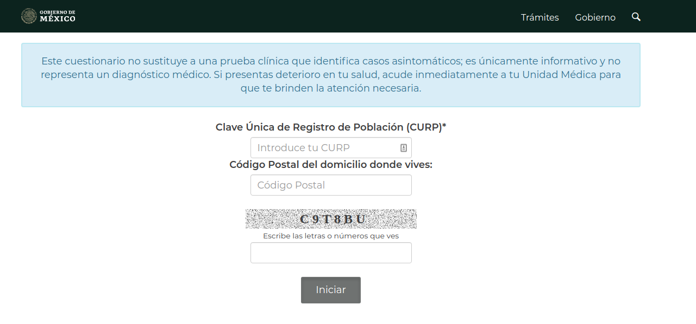

# Reto 02
## Objetivo

Utilizar lo aprendido para crear una aplicación de terminal que guarde las respuestas de una encuesta en un archivo de manera local.

## Desarrollo

Crea una aplicación de terminal para hacer un formulario para saber si una persona presenta los principales síntomas de COVID-19.

### Requerimientos:

Los resultados de las preguntas deberán almacenarse de manera local en un archivo con el nombre de la persona que ha respondido el cuestionario, así que esa deberá ser la primera pregunta.

Ejemplo: `daniel_garcia.txt`

Puedes basarte en las preguntas del sitio web:

[Test Coronavirus](https://testcoronavirus.imss.gob.mx/webcovid19/)

Puedes comenzar desde la siguiente pantalla

Si lo deseas puedes llenarlo para poder conocer las preguntas.

> **Notas**
>
>- Puedes dividir el cuestionario en varias partes para mejor legibilidad en la terminal
>- Es suficiente con que guardes los resultados de la encuesta de manera ordenada en un folder.
>- Puedes investigar cuántas respuestas positivas se necesitan para que sea un caso sospechoso.
