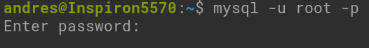
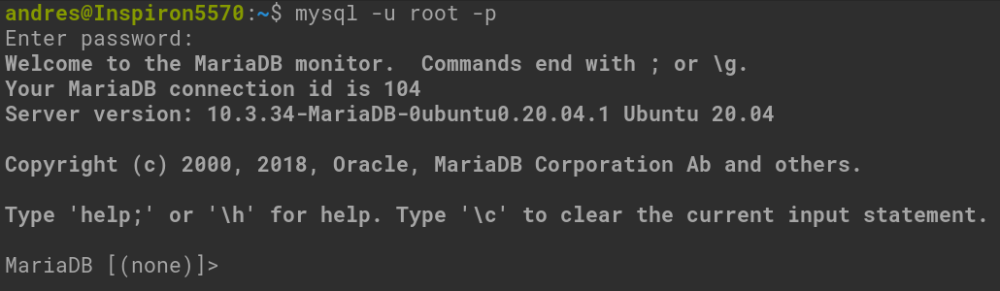
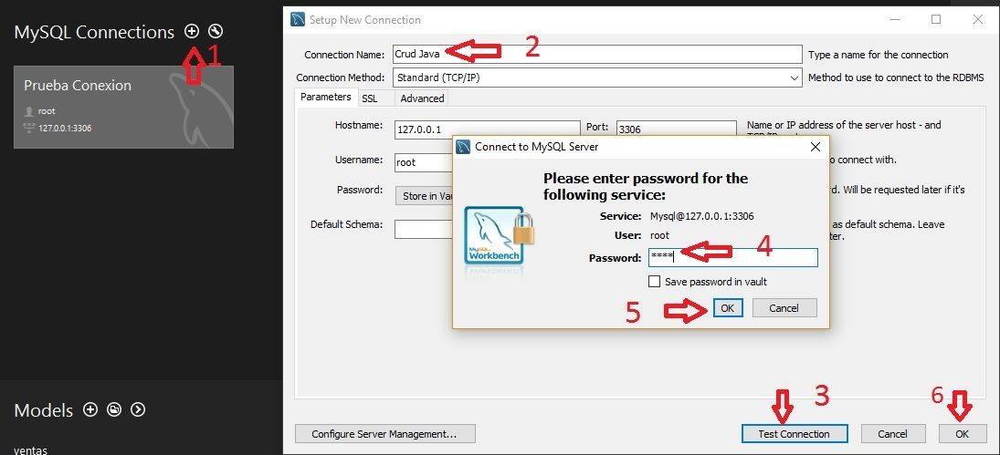
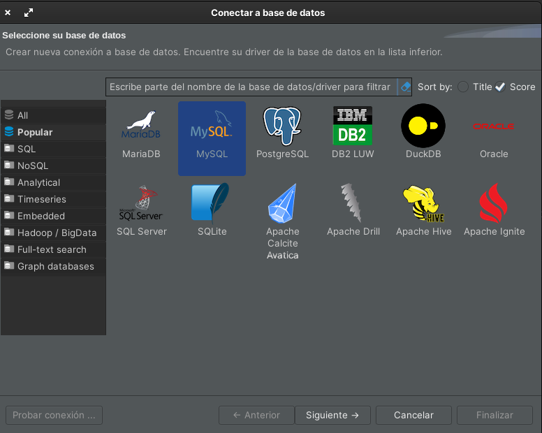
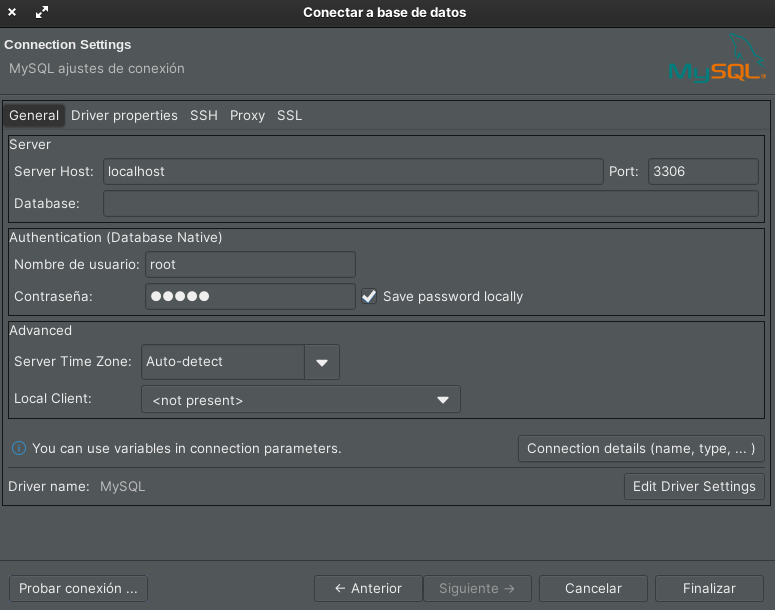
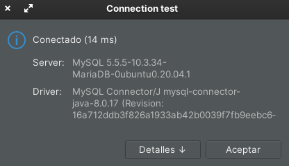
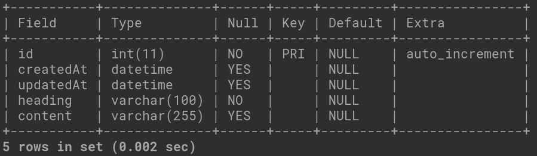

# Example 2
### Objetivos
- Instalar MySQL Server
- Conectarse a la base de datos "Terminal y/o gestor de base de datos"
- Crear la tabla Notas

### Requerimientos
- Haber completado el Ejemplo 1.
- Tener instalado el servidor de base de datos: MySQL.
- Tener una base de datos previamente creada con la estructura solicitada.

### Desarrollo

Para instalar el servidor nos dirigimos a la siguiente página [`MySQL Server`](https://dev.mysql.com/downloads/mysql/)

> **IMPORTANTE:** Almacena en un lugar seguro la contraseña.

> Puedes ayudarte de los siguientes recursos:
>> Mac dmg
>> https://dev.mysql.com/doc/refman/5.7/en/macos-installation-pkg.html
>
>> Mac brew https://flaviocopes.com/mysql-how-to-install/
>
>> Windows
>> https://www.dataquest.io/blog/install-mysql-windows/
>
>> Linux
>> https://www.digitalocean.com/community/tutorials/how-to-install-mysql-on-ubuntu-20-04

Una vez instalado el servidor nos conectamos con la Terminal y con el gestor de base de datos.

- Para conectarse con la terminal ingresamos lo siguiente:
  ```
  mysql -u root -p
  ```
  Damos clic y agregamos la contraseña

  

  Esto realizará la conexión

  

- Para conectarse con el gestor de base de datos:

  - MySQL Workbench

    

  - DBeaver

    
    
    


#### Estructura de la base de datos

Una vez realizada la conexión con la DB, crear la base de datos y la tabla de Notes.

- Crear base de datos:

  ```sql
  create database sesion5;
  ```

- Seleccionar base de datos

  ```sql
  use sesion5;
  ```

- Crear tabla Notes

  ```
  -----------------------------------------------------|
  | Notes                                              |
  -----------------------------------------------------|
  | id          INT      Primary Key   AutoIncrement   |
  | createdAt   DATETIME                               |
  | updatedAt   DATETIME                               |
  | heading     VARCHAR                                |
  | content     TEXT                                   |
  -----------------------------------------------------|
  ```

  ```sql
  CREATE TABLE Notes  ( 
    id INT NOT NULL auto_increment,
    createdAt DATETIME,
    updatedAt DATETIME,
    heading VARCHAR(100) NOT NULL,  
    content VARCHAR(255),
    PRIMARY KEY(id)
  );
  ```

- Consultar estructura de tabla

  ```sql
  describe Notes;
  ```
  

<br/>

[Siguiente Ejemplo 03](../Ejemplo-03/README.md)