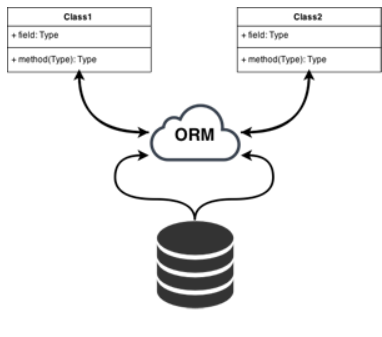

# PREWORK

### OBJETIVO

* Identificar el uso de la librería express
* Qué es un ODM y un ORM

## Sesión 05

Ve los videos y recursos que se enlistan a continuación para identificar y aprender los conceptos básicos necesarios que se verán en la sesión. Haz anotaciones o crea un mapa mental con los conceptos que consideres que son básicos y necesarios para la sesión. 

* Ve el siguiente [video](https://www.youtube.com/watch?v=OMzOK7V0k3Q&ab_channel=OpenWebinars), el cual te explicará para qué es express y cuales son sus aplicaciones.

* En el siguiente [video](https://www.youtube.com/watch?v=pS1nrxDj3yM&ab_channel=C%C3%B3digoconJuan), identificarás qué es un ORM y cual es su uso.

* Lee el siguiente [artículo](https://developer.mozilla.org/es/docs/Learn/Server-side/Express_Nodejs/Introduction) para profundizar en el uso de express.

### Métodos de petición HTTP

HTTP define un conjunto de métodos de petición para indicar la acción que se desea realizar para un recurso determinado. Aunque estos también pueden ser sustantivos, estos métodos de solicitud a veces son llamados HTTP verbs.

* [GET](https://developer.mozilla.org/en-US/docs/Web/HTTP/Methods/GET) El método GET solicita una representación de un recurso específico. Las peticiones que usan el método GET sólo deben recuperar datos.

* [HEAD](https://developer.mozilla.org/en-US/docs/Web/HTTP/Methods/HEAD) El método HEAD pide una respuesta idéntica a la de una petición GET, pero sin el cuerpo de la respuesta.

* [POST](https://developer.mozilla.org/en-US/docs/Web/HTTP/Methods/POST) El método POST se utiliza para enviar una entidad a un recurso en específico, causando a menudo un cambio en el estado o efectos secundarios en el servidor.

* [PUT](https://developer.mozilla.org/en-US/docs/Web/HTTP/Methods/PUT) El modo PUT reemplaza todas las representaciones actuales del recurso de destino con la carga útil de la petición.

* [DELETE](https://developer.mozilla.org/en-US/docs/Web/HTTP/Methods/DELETE) El método DELETE borra un recurso en específico.

* [CONNECT](https://developer.mozilla.org/en-US/docs/Web/HTTP/Methods/CONNECT) El método CONNECT establece un túnel hacia el servidor identificado por el recurso.

* [OPTIONS](https://developer.mozilla.org/en-US/docs/Web/HTTP/Methods/OPTIONS) El método OPTIONS es utilizado para describir las opciones de comunicación para el recurso de destino.

* [TRACE](https://developer.mozilla.org/en-US/docs/Web/HTTP/Methods/TRACE) El método TRACE realiza una prueba de bucle de retorno de mensaje a lo largo de la ruta al recurso de destino.

* [PATCH](https://developer.mozilla.org/en-US/docs/Web/HTTP/Methods/PATCH) El método PATCH es utilizado para aplicar modificaciones parciales a un recurso.
 
### ¿Qué es un ORM?

Un ORM te permite convertir los datos de tus objetos en un formato correcto para poder guardar la información en una base de datos (mapeo) creándose una base de datos virtual donde los datos que se encuentran en nuestra aplicación, quedan vinculados a la base de datos (persistencia).

Si alguna vez has programado alguna aplicación que se conecta a una base de datos, habrás podido comprobar lo laborioso que es transformar toda la información que recibes de la base datos, principalmente en tablas, en los objetos de tu aplicación y viceversa. A ésto se le denomina mapeo.

Utilizando un ORM este mapeo será automático, es más, será independiente de la base de datos que estés utilizando en ese momento pudiendo cambiar de motor de base de datos según tus necesidades.Veamos un ejemplo. Supongamos que tenemos una tabla de clientes. En nuestra aplicación queremos hacer las funciones básicas sobre base de datos CRUD (del inglés Create, Read, Update and Delete) Crear, Obtener, Actualizar y Borrar. Cada operación corresponde con una sentencia SQL.



### ¿Qué es un ODM?

MongoDB expresa los datos que se guardarán en un formato similar a JSON y los guarda como un documento. La función de asociar tal documento con un objeto en un lenguaje de programación se llama Object-Document Mapper.

Dado que los documentos MongoDB son formatos similares a JSON, es posible tener una estructura jerárquica (anidada).

Ej:

```json
{
    "name": "John Smith",
    "age": 20,
    "email": "foo@example.com"
}
```