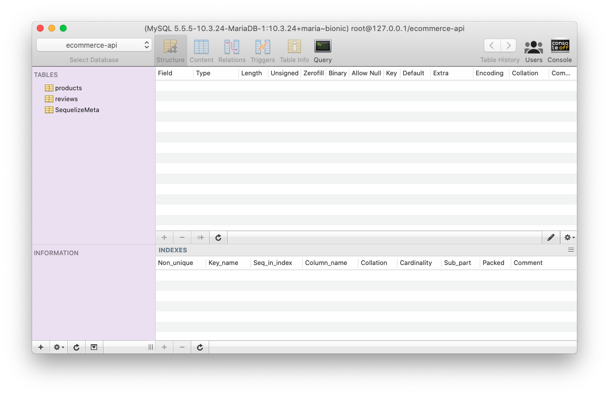

# Ejemplo #02
### Objetivo
Generar los modelos de datos y la base de datos utilizando Sequelize.

### Desarrollo
En el reto anterior, estuviste analizando la problematica de Pepe, como sabes esto es uno de los pasos esenciales al momento de desarrollar software ya que te permite tener una visión más completa de como solucionarlo y además, tiene las pistas necesarias para lograrlo.

Así que, con eso que has logrado obtener es momento de ponernos manos a la obra.

#### Creación de la base de datos
1. Ahora que tienes los modelos listos, construiremos la base de datos utilizando el CLI de Sequelize, que nos permitirá generar de una manera más simple y sencilla nuestra base de datos a través de las migraciones. Para ello instalaremos nuestras dependencias necesarias:

    ```
    npm i sequelize mysql
    npm i -D sequelize-cli
    ```

2. Una vez terminada la instalación, es momento de crear nuestras migraciones, en este ejemplo nos enfocaremos en la tabla de `productos` y `reseñas`.

    ```bash
    # Creando la migración para productos 
    ./node_modules/.bin/sequelize migration:create --name CreateTableProducts
    ```

    ```js
    'use strict';

    module.exports = {
      up: async (queryInterface, Sequelize) => {
        await queryInterface.createTable('products', {
          id: { type: Sequelize.INTEGER, primaryKey: true, autoIncrement: true },
          name: Sequelize.STRING,
          description: Sequelize.TEXT,
          price: Sequelize.FLOAT,
          image: Sequelize.STRING,
          createdAt: Sequelize.DATE,
          updatedAt: Sequelize.DATE,
        });
      },

      down: async (queryInterface, Sequelize) => {
        await queryInterface.droptabke('products');
      }
    };
    ```

    ```bash
    # Creando la migración para reseñas 
    ./node_modules/.bin/sequelize migration:create --name CreateTableReviews
    ```

    ```js
    'use strict';

    module.exports = {
      up: async (queryInterface, Sequelize) => {
        await queryInterface.createTable('reviews', {
          id: { type: Sequelize.INTEGER, primaryKey: true, autoIncrement: true },
          content: Sequelize.TEXT,
          productId: {
            type: Sequelize.INTEGER,
            references: {
              model: 'products',
              key: 'id',
            },
            onDelete: 'CASCADE',
          },
          createdAt: Sequelize.DATE,
          updatedAt: Sequelize.DATE,
        })
      },

      down: async (queryInterface, Sequelize) => {
        await queryInterface.dropTable('reviews');
      }
    };
    ```

2. Una vez que hemos terminado de construir nuestras migraciones, es momento de ejecutarlas. Para esto necesitaremos primeramente generar un archivo `/config/config.json`, donde Sequelize CLI obtendra los datos de conexión a nuestra base de datos y de esta manera ejecutar las migraciones.

    ```json
    {
      "development": {
        "username": "root",
        "password": "root",
        "database": "ecommerce-api",
        "host": "127.0.0.1",
        "port": "3306",
        "dialect": "mariadb"
      }
    }
    ```

    > Recuerda cambiar los datos de conexión con los datos correspondientes a tu instalación, ya que de lo contrario, la conexión fallará.

3. Ahora si, estamos listos para ejecutar las migraciones.

    ```bash
    ./node_modules/.bin/sequelize db:migrate
    ```

    > Antes de ejecutarlo, asegurate de haber generado tu base de datos en tu SMBD.

    Si todo ha ido a la perfección podrás observar lo siguiente en tu terminal.

    ```bash
    Sequelize CLI [Node: 12.16.1, CLI: 6.2.0, ORM: 6.3.5]

    Loaded configuration file "config/config.json".
    Using environment "development".
    == 20201006150149-CreateTableProducts: migrating =======
    == 20201006150149-CreateTableProducts: migrated (0.014s)

    == 20201006150853-CreateTableReviews: migrating =======
    == 20201006150853-CreateTableReviews: migrated (0.012s)
    ```

    > Los identificadores (ej. 20201006150853) de las migraciones pueden variar ya que estos son autogenerados por la herramienta Sequelize CLI.

    Ahora, si tu tienes alguna herramienta GUI para conectarte a tu base de datos, podrás ver que dentro ya estarán creadas las tablas.
    

  [Ir al reto #2](../reto-02/README.md)

#### Creando nuestros modelos de datos
1. Enhorabuena! Ya hemos creado nuestras primeras tablas. Ahora toca el turno de la generación de los modelos. De acuerdo a tablas que recien hemos generado, definiremos nuestros modelos de datos utilizando Sequelize.

    ```js
    // /models/Product.js
    const { DataTypes } = require('sequelize');

    module.exports = (sequelize) => sequelize.define('products', {
      id: { type: DataTypes.INTEGER, primaryKey: true, autoIncrement: true },
      name: DataTypes.STRING,
      description: DataTypes.TEXT,
      price: DataTypes.FLOAT,
      image: DataTypes.STRING,
      createdAt: DataTypes.DATE,
      updatedAt: DataTypes.DATE,
    }, {
      hooks: {
        beforeCreate: function (produt, options) {
          produt.createdAt = new Date();
          produt.updatedAt = new Date();
        },
        beforeUpdate: function (produt, options) {
          produt.updatedAt = new Date();
        },
      },
    });
    ```

    ```js
    // /models/Review.js
    const { DataTypes, Sequelize } = require('sequelize');

    module.exports = (sequelize) => sequelize.define('reviews', {
      id: { type: DataTypes.INTEGER, primaryKey: true, autoIncrement: true },
      content: DataTypes.TEXT,
      productId: {
        type: Sequelize.INTEGER,
        references: {
          model: 'products',
          key: 'id',
        },
        onDelete: 'CASCADE',
      },
      createdAt: DataTypes.DATE,
      updatedAt: DataTypes.DATE,
    }, {
      hooks: {
        beforeCreate: function (review, options) {
          review.createdAt = new Date();
          review.updatedAt = new Date();
        },
        beforeUpdate: function (review, options) {
          review.updatedAt = new Date();
        },
      },
    });
    ```

#### Conexión a la base de datos y registro de modelos
5. Una vez que hemos generado nuestros modelos, es momento de registrarlos. Para lograrlo crearemos un archivo `db.js`.

    ```js
    // db.js
    const { Sequelize } = require('sequelize');

    // Importing models
    const Product = require('./models/Product');
    const Review = require('./models/Review');

    // Database connection
    const sequelize = new Sequelize('ecommerce-api', 'root', 'root', {
      host: 'localhost',
      dialect: 'mariadb',
      logging: false,
    });

    // Getting models
    const models = [
      Product,
      Review,
    ];

    // Registering models into Sequelize
    for (let model of models) {
      model(sequelize);
    }

    // Configuring relations
    const { products, reviews } = sequelize.models;
    reviews.belongsTo(products); // Relation one-to-one in reviews table

    module.exports = sequelize;
    ```

[Ir al reto #3](../reto-03/README.md)
