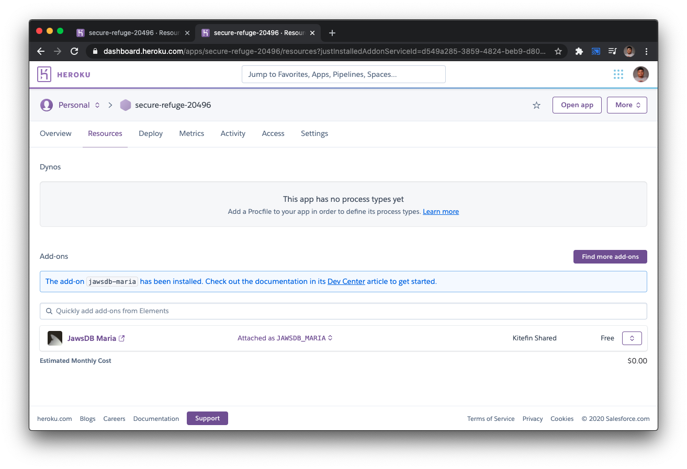

# Ejemplo #2: Deploy
### Description
En el ejemplo anterior, preparamos nuestro ambiente para que este listo para lanzarlo a producción.

### Requerimientos
- Git.
- Una cuenta en Heroku. [Crear cuenta](https://www.heroku.com/).
- Tener instalado `Heroku CLI`. [Download](https://devcenter.heroku.com/articles/heroku-cli#download-and-install).

### Desarrollo
Una vez que hayamos creado nuestra cuenta de `Heroku` vamos a dirigirnos a nuestro proyecto final, si no llegaste a completar todos los ejercicios y/o ejemplos, puedes copiar el contenido dentro de `code` en el **Ejemplo #1**.

> Nota: Heroku no puede desplegar tu proyecto si tu package.json se encuentra dentro de un subdirectorio así que si hiciste una copia del proyecto final no lo agreges dentro de un subdirectorio o mantenlo aislado, ya que con ese proyecto configuraremos otra fuente remota a un servidor de Git.

Ahora que estamos dentro de nuestro proyecto, debemos asegurarnos que nos encontramos en el directorio correcto. Vamos a abrir una nueva terminal y crearemos nuestra aplicación utilizando el CLI de Heroku.

#### Inicialización de aplicación
1. Primero iniciaremos sesión dentro de nuestro CLI.
```bash
heroku login
```

2. Al ejecutar este comando nos indicará que presionemos cualquier tecla para continuar y seremos redireccionados a la página de Heroku para iniciar sesión. Si tu sesión ha iniciado correctamente, verás algo como lo siguiente.
```
Logging in... done
Logged in as <youremail>
```

3. Ahora, ejecutaremos el comando de creación para crear una aplicación dentro de Heroku.
```
heroku create
```

4. Si todo ha funcionado de forma correcta, podremos ver la información, URL y nombre de nuestra aplicación, así como la fuente remota a nuestro servidor de Git dentro de Heroku.
```
Creating app... done, ⬢ secure-refuge-20496
https://secure-refuge-20496.herokuapp.com/ | https://git.heroku.com/secure-refuge-20496.git
```

> Nota. Los nombres de las aplicaciones son aleatorias por lo que no serán las mismas a la de la illustración.

5. Vamos a comprobar si el origen remoto ha sido agregado a tu proyecto, ya que lo vamos a necesitar. Ejecutaremos el siguiente comando para validarlo:
```
git remote -v
```
Deberás ver la siguiente información:
```
heroku	https://git.heroku.com/secure-refuge-20496.git (fetch)
heroku	https://git.heroku.com/secure-refuge-20496.git (push)
```

> En caso de que todo funcione correctamente, salta al punto #8.

6. Si no haz obtenido el resultado anterior, deberás primeramente inicializar un proyecto de Git y posteriormente, agregar la URL de Git que Heroku te ha proporcionado. Ejecuta los siguientes comandos:
```
$ git init
$ git remote add heroku https://git.heroku.com/secure-refuge-20496.git
```

7. Ahora, realiza el mismo procedimiento del punto #5.

8. Ahora que hemos creado nuestra aplicación podemos dirigirnos al sitio web de Heroku para continuar con la configuración.


#### Configuración de ambiente
Ahora que nuestra aplicación ya se encuentra visible, vamos a acceder a nuestra aplicación y vamos a configurar nuestra base de datos, utilizando el sistema de AddOns de Heroku.

1. Vamos a dar clic sobre nuestra aplicación y nos vamos a dirigir a la sección de `Resources`, en esta página podremos observar que se encuentra un botón que dice `Find more add-ons`, vamos a dar clic sobre ese botón.


2. Dentro de esa página a la que nos ha redirigido, vamos a buscar el servicio llamado `JawsDB Maria`, que nos permitirá generar un servidor de base de datos sobre MariaDB.


3. Ahora que ya lo hemos encontrado vamos a darle clic, y dentro del detalle de este servicio podremos como funciona y que planes tenemos disponibles, vamos a hacer clic sobre el botón `Install JawsDB Maria`.


4. En esta sección seleccionaremos la versión gratuita (Free) y buscaremos nuestra aplicación para asociarla, 
.

5. Ya una vez que hemos seleccionado nuestra aplicación, vamos a darle clic sobre el botón `Submit Order Form`

> Nota: Lamentablemente para completar el paso #5, es necesario ingresar una tarjeta para continuar con el proceso, no te preocupes si sospechas de que se te haran cargos, solo hara uno de validación que será devuelto. Sin embargo, es un requisito, de lo contrario no podrás continuar.

> Nota: Mientras todos los servicios que utilizes sean en formato Free, no se te hará ningún cargo. Si solo vas a utilizar la cuenta para hacer el ejercicio, una vez que lo hayas completado, puedes proceder a eliminar la aplicación y quitar tus datos bancarios.

6. Una vez hayamos concluido el proceso, vamos a poder ver ese nuevo servicio agregado a nuestra aplicación, listo para empezar a funcionar.


7. Ahora, vamos a dar clic sobre nuestro servicio recientemente agregado y seremos redirigidos a nuestro panel de administración de `JawsDB Maria` donde podremos encontrar los datos de conexión a la base datos.


#### Configurando nuestras variables de entorno
1. Ahora que ya hemos levantado nuestro servidor de base de datos, vamos a configurar las variables de entorno. Para eso hay que dirigirnos a la configuración (Settings) de nuestra aplicación dentro de Heroku.


2. Damos clic sobre el botón `Reveal Config Var` y procederemos a configurar nuestras variables de entorno.

> Recordemos que generamos un archivo `.env`lo utilizaremos como base para registrar nuestras variables, asegurate de colocar los datos correctos de conexión que vimos en el paso #7 de la sección anterior. Para este ejercicio solo vamos a excluir la variable `PORT` ya que esta se agrega automáticamente por parte de Heroku.

```
# Authorization
JWT_SECRETKEY=secretkey
JWT_EXPIRESIN=36000

# Database
MARIADB_USER=username
MARIADB_PASSWORD=password
MARIADB_DATABASE=database-name
MARIADB_HOST=127.0.0.1
MARIADB_PORT=3306
```


> Puedes generar tu propia SecretKey o utilizar alguna herramienta para la generación de claves. https://randomkeygen.com/.

3. Ahora, solo queda agregar una configuración necesaría para ejecutar las migraciones en cada release e inicie nuestra aplicación. Vamos a agregar un archivo `Procfile` donde agregaremos la configuración necesaria para que Heroku ejecute nuestra aplicación.
```
release: npx sequelize-cli db:migrate
web: node app.js
```

Estamos listos para publicar nuestra aplicación 🚀

#### Publicando nuestro código
Ahora que ya hemos terminado de configurar todos los requerimientos necesarios para que nuestra aplicación funcione es momento de publicarla.

1. Vamos a commitear nuestro código hasta ahora para proceder con la subida de nuestro código a Heroku. Así que creemos un commit con los cambios que hemos hecho hasta aquí.
```
git add .
git commit -m "Ready to Deploy"
```

2. Una vez guardados los cambios, ejecutaremos el comando para subir nuestros archivos a Heroku.
```
git push heroku master
```
Una vez que hemos iniciado el proceso de publicación, Heroku empezará a construir nuestra aplicación y a ejecutar nuestro proyecto con sus dependencias.

```
Enumerating objects: 31, done.
Counting objects: 100% (31/31), done.
Delta compression using up to 12 threads
Compressing objects: 100% (28/28), done.
Writing objects: 100% (31/31), 25.39 KiB | 5.08 MiB/s, done.
Total 31 (delta 6), reused 0 (delta 0), pack-reused 0
remote: Compressing source files... done.
remote: Building source:
remote:
remote: -----> Node.js app detected
remote:
remote: -----> Creating runtime environment
remote:
remote:        NPM_CONFIG_LOGLEVEL=error
remote:        NODE_ENV=production
remote:        NODE_MODULES_CACHE=true
remote:        NODE_VERBOSE=false
remote:
remote: -----> Installing binaries
remote:        engines.node (package.json):  unspecified
remote:        engines.npm (package.json):   unspecified (use default)
remote:
remote:        Resolving node version 12.x...
remote:        Downloading and installing node 12.19.0...
remote:        Using default npm version: 6.14.8
remote:
remote: -----> Installing dependencies
remote:        Installing node modules
remote:
remote:        > bcrypt@5.0.0 install /tmp/build_0b16d21a/node_modules/bcrypt
remote:        > node-pre-gyp install --fallback-to-build
remote:
remote:        [bcrypt] Success: "/tmp/build_0b16d21a/node_modules/bcrypt/lib/binding/napi-v3/bcrypt_lib.node" is installed via remote
remote:        added 218 packages in 4.621s
remote:
remote: -----> Build
remote:
remote: -----> Caching build
remote:        - node_modules
remote:
remote: -----> Pruning devDependencies
remote:        removed 59 packages and audited 159 packages in 2.241s
remote:
remote:        1 package is looking for funding
remote:          run `npm fund` for details
remote:
remote:        found 0 vulnerabilities
remote:
remote:
remote: -----> Build succeeded!
remote: -----> Discovering process types
remote:        Procfile declares types -> release, web
remote:
remote: -----> Compressing...
remote:        Done: 25.9M
remote: -----> Launching...
remote:  !     Release command declared: this new release will not be available until the command succeeds.
remote:        Released v13
remote:        https://secure-refuge-20496.herokuapp.com/ deployed to Heroku
remote: Running release command...
remote:
remote: npx: installed 77 in 7.408s
remote:
remote: Sequelize CLI [Node: 12.19.0, CLI: 6.2.0, ORM: 6.3.5]
remote:
remote: Loaded configuration file "config/config.js".
remote: Using environment "production".
remote: warning: please use IANA standard timezone format ('Etc/GMT0')
remote: warning: please use IANA standard timezone format ('Etc/GMT0')
remote: == 20201006150149-CreateTableProducts: migrating =======
remote: == 20201006150149-CreateTableProducts: migrated (0.038s)
remote:
remote: == 20201006150853-CreateTableReviews: migrating =======
remote: == 20201006150853-CreateTableReviews: migrated (0.031s)
remote:
remote: == 20201008130512-CreateTableUsers: migrating =======
remote: == 20201008130512-CreateTableUsers: migrated (0.023s)
remote:
remote: == 20201008131051-CreateTableOrders: migrating =======
remote: == 20201008131051-CreateTableOrders: migrated (0.029s)
remote:
remote: Waiting for release.... done.
To https://git.heroku.com/secure-refuge-20496.git
   f3f5041..2cfae4d  master -> master
```

3. Si todo ha ido correctamente, podremos acceder a los logs de nuestra aplicación para ver si esta funcionando correctamente.
```
heroku logs --tail
```

Podremos observar que nuestra aplicación esta siendo ejecutada en un puerto aleatorio de Heroku.
```
2020-10-16T06:13:18.277940+00:00 heroku[web.1]: State changed from crashed to starting
2020-10-16T06:13:20.906652+00:00 heroku[web.1]: Starting process with command `node app.js`
2020-10-16T06:13:23.751401+00:00 app[web.1]: Express on port 20976
2020-10-16T06:13:24.117035+00:00 heroku[web.1]: State changed from starting to up
```

4. Por último, solo nos queda comprobar en la URL generada por Heroku que nuestra aplicación funcione correctamente. Para comprobarlo podemos hacer una consulta a nuestro path `/api/products` desde nuestro navegador.


Por ahora, nos mandará un mensaje de `Unauthorized`, ya que no estamos autenticados dentro de nuestra API.

<br/>

[Ir al Ejemplo #3](../Ejemplo-3/README.md)