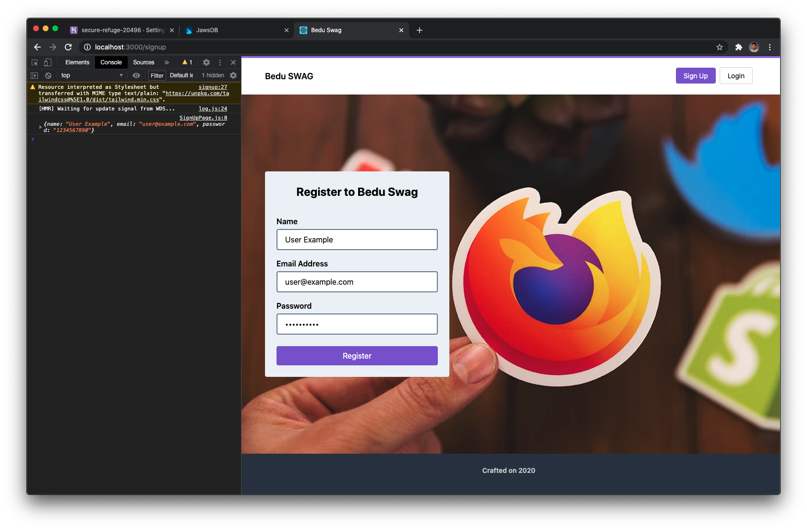
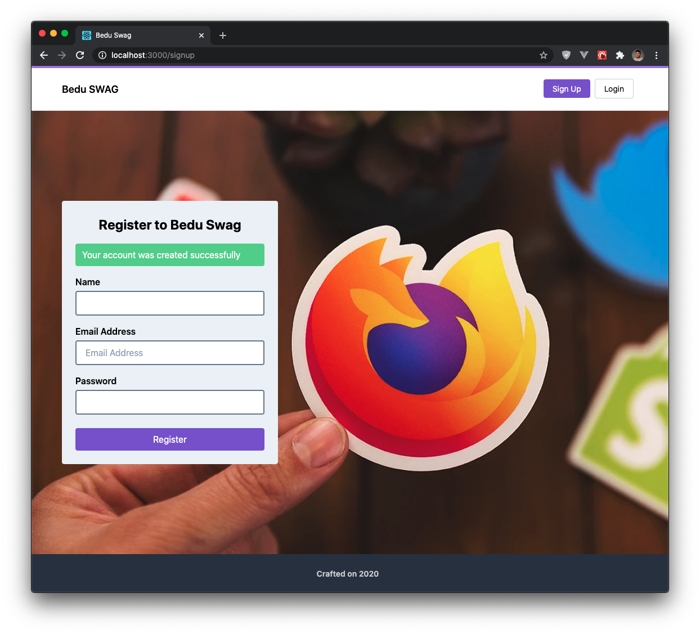

# Ejemplo #3: Creando nuestro panel de autenticación en React
### Descripción
Ahora que ya hemos completado nuestro proceso de despliegue, podemos continuar con la implementación y lo primero que vamos a realizar, es la creación de cuentas e inicio de sesión.

### Requerimientos
- Haber descargado el Scaffolding íncludo dentro de esta misma sesión.

### Desarrollo
1. Vamos desarrollar nuestra lógica de desarrollo para la creación de cuentas. Para ello vamos a instalar una nueva dependencia que nos permitirá gestionar nuestros formularios de una manera más simple, instalaremos `React Hook Form`.
```
npm i -S react-hook-form
```

2. Importaremos nuestro paquete e inicializaremos un nuevo formulario a través de React Hook Form.
```js
import React from 'react';
import { useForm } from 'react-hook-form';

const SignUpPage = () => {
  const { handleSubmit, register } = useForm();
  ...
}

export default SignUpPage;
```

> También podemos hacer validaciones dentro del cliente para saber si lo que introduce el usuario es permitido, si quieres saber más al respecto, puedes verlo dentro de la [documentación de React Hook Form](https://react-hook-form.com/).

3. Ahora, registraremos cada uno de nuestro elementos de entrada dentro del formulario `SignUp`.

```html
<div className="flex flex-col mb-4">
  <label className="font-semibold mb-1">Name</label>
  <input ref={register} className="py-2 px-4 bg-white rounded border-2 border-gray-600" type="text" name="name" placeholder="" />
</div>
<div className="flex flex-col mb-4">
  <label className="font-semibold mb-1">Email Address</label>
  <input ref={register} className="py-2 px-4 bg-white rounded border-2 border-gray-600" type="text" name="email" placeholder="Email Address" />
</div>
<div className="flex flex-col mb-6">
  <label className="font-semibold mb-1">Password</label>
  <input ref={register} className="py-2 px-4 bg-white rounded border-2 border-gray-600" type="password" name="password" placeholder="" />
</div>
```

4. También, vamos a agregar una función que nos permita obtener la información proveniente de nuestro formulario.
```js
const onSubmit = (values) => {
  console.log(value);
}
```

5. Además, agregaremos el `handler` para escuchar el evento de registro dentro del formulario y además le indicaremos que función deberá ejecutar al escuchar dicho evento.
```html
<form className="bg-gray-200 rounded p-6" onSubmit={handleSubmit(onSubmit)}>
```

6. Con estos cambios que hemos hecho si probamos nuestra aplicación podremos ver nuestros datos mostrados dentro de la consola del navegador.


7. Ahora, antes de enviar estos datos al servidor que hemos desplegado, debemos crear una variable de entorno que nos permita configurar de una mejor manera la URL a donde deberá enviar los datos. Para eso, crearemos un archivo `.env` para definir nuestras variables necesarias.

```
REACT_APP_BACKEND_API=https://secure-refuge-20496.herokuapp.com
```

> Como recordaras el archivo `.env` no lo debemos pyublicar ya que puede tener contenido sensible, en su lugar debemos publicar uno de ejemplo.

8. Ya que hemos configurado nuestra variable de entorno, es momento de crear nuestra lógica de desarrollo. Esta la haremos dentro de nuestra página `SignUp`, así que modificaremos el archivo `/src/pages/SignUpPage.js`.

Primero agregaremos unas variables de estado que nos permitirá mostrar un mensaje de error o de éxito al hacer el procesamiento de nuestra información.
```js
const [error, setError] = useState('');
const [showSuccessMessage, setShowSuccessMessage] = useState('');
```

Ahora nos centraremos en la lógica para hacer el llamado a nuestro servidor.
```js
 const onSubmit = async (values) => {
    setError(''); // Resetting submit errors
    setShowSuccessMessage(''); // Resetting submit success message
    const response = await fetch(process.env.REACT_APP_BACKEND_API + '/api/auth/signup', {
      method: 'POST',
      body: JSON.stringify(values),
      headers: {
        'Content-Type': 'application/json'
      }
    })
    const body = await response.json();
    if (!response.ok) {
      setError(body.message);
    } else {
      setShowSuccessMessage(body.message);
      reset(); // After submit successfully we need to reset the form
    }
  }
```

Dentro de nuestra lógica, necesitamos reiniciar el formulario después de haber sido registrado el usuario correctamente, para ello utilizaremos el método `reset` dentro de nuestra instancia de `React Hook Form`.
```js
const { handleSubmit, register, reset } = useForm();
```

Y por último, dentro del componente agregaremos estás las dos variables de estado para darle el comportamiento adecuado.
```html
<form className="bg-gray-200 rounded p-6" onSubmit={handleSubmit(onSubmit)}>
  <h2 className="text-2xl mb-4 text-center font-bold">Register to Bedu Swag</h2>
  { error
    ? <span className="inline-block w-full px-3 py-2 rounded bg-red-500 text-white mb-4">
      {error}
    </span>
    : null }
  { showSuccessMessage
    ? <span className="inline-block w-full px-3 py-2 rounded bg-green-400 text-white mb-4">
      {showSuccessMessage}
    </span>
    : null }
</form>
```

9. Una vez que hayas concluido con esta implementación, puedes proceder a hacer la prueba de registrar una cuenta dentro de tu servicio web.


[Continuar con el Reto #1](../Reto-1/README.md)
